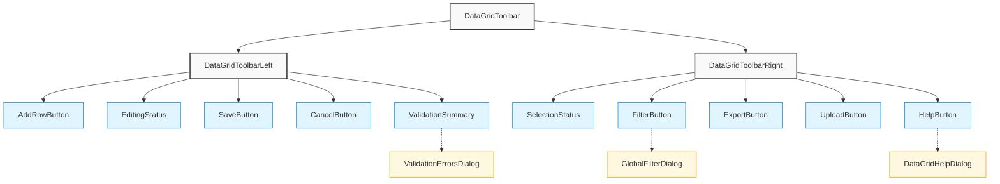
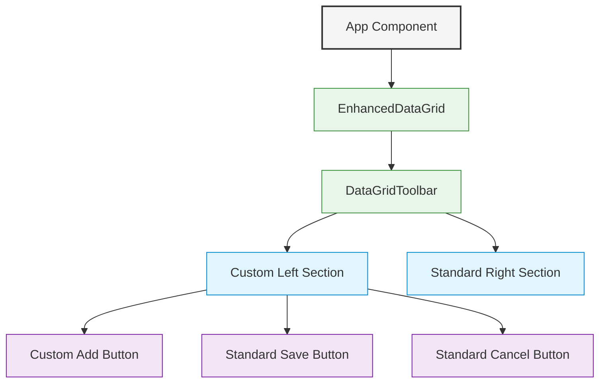

# DataGrid Toolbar Architecture Diagram

This document provides visual diagrams of the new modular toolbar architecture.

## Component Structure

## Data Flow

```mermaid
graph TD
    %% Contexts
    GridModeContext[GridModeContext]
    GridFormContext[GridFormContext]
    
    %% Main Components
    DataGridToolbar[DataGridToolbar]
    DataGridToolbarLeft[DataGridToolbarLeft]
    DataGridToolbarRight[DataGridToolbarRight]
    
    %% Left Section Components
    AddRowButton[AddRowButton]
    EditingStatus[EditingStatus]
    SaveButton[SaveButton]
    CancelButton[CancelButton]
    ValidationSummary[ValidationSummary]
    
    %% Right Section Components
    SelectionStatus[SelectionStatus]
    FilterButton[FilterButton]
    ExportButton[ExportButton]
    UploadButton[UploadButton]
    HelpButton[HelpButton]
    
    %% Data Flow
    GridModeContext --> DataGridToolbar
    GridFormContext --> DataGridToolbar
    
    DataGridToolbar --> DataGridToolbarLeft
    DataGridToolbar --> DataGridToolbarRight
    
    %% Left Section Data Flow
    GridModeContext --> AddRowButton
    GridModeContext --> EditingStatus
    GridModeContext --> SaveButton
    GridModeContext --> CancelButton
    GridFormContext --> ValidationSummary
    
    DataGridToolbarLeft --> AddRowButton
    DataGridToolbarLeft --> EditingStatus
    DataGridToolbarLeft --> SaveButton
    DataGridToolbarLeft --> CancelButton
    DataGridToolbarLeft --> ValidationSummary
    
    %% Right Section Data Flow
    GridModeContext --> SelectionStatus
    GridModeContext --> FilterButton
    GridModeContext --> ExportButton
    GridModeContext --> UploadButton
    
    DataGridToolbarRight --> SelectionStatus
    DataGridToolbarRight --> FilterButton
    DataGridToolbarRight --> ExportButton
    DataGridToolbarRight --> UploadButton
    DataGridToolbarRight --> HelpButton
    
    %% Actions
    AddRowButton -- "addRow()" --> GridModeContext
    SaveButton -- "saveChanges()" --> GridModeContext
    CancelButton -- "cancelChanges()" --> GridModeContext
    SelectionStatus -- "clearSelection()" --> GridModeContext
    
    %% Style
    classDef context fill:#e8f5e9,stroke:#388e3c,stroke-width:2px
    classDef container fill:#f9f9f9,stroke:#333,stroke-width:2px
    classDef component fill:#e1f5fe,stroke:#0288d1,stroke-width:1px
    
    class GridModeContext,GridFormContext context
    class DataGridToolbar,DataGridToolbarLeft,DataGridToolbarRight container
    class AddRowButton,EditingStatus,SaveButton,CancelButton,ValidationSummary,SelectionStatus,FilterButton,ExportButton,UploadButton,HelpButton component
```

## Headless Architecture (Phase 2)

```mermaid
graph TD
    %% Contexts
    GridModeContext[GridModeContext]
    GridFormContext[GridFormContext]
    
    %% Main Hooks
    useDataGridToolbar[useDataGridToolbar]
    useDataGridToolbarLeft[useDataGridToolbarLeft]
    useDataGridToolbarRight[useDataGridToolbarRight]
    
    %% Individual Hooks
    useAddRow[useAddRow]
    useEditingStatus[useEditingStatus]
    useSaveChanges[useSaveChanges]
    useCancelChanges[useCancelChanges]
    useValidationSummary[useValidationSummary]
    useSelectionStatus[useSelectionStatus]
    useFilter[useFilter]
    useExport[useExport]
    useUpload[useUpload]
    useHelp[useHelp]
    
    %% Custom Components
    CustomToolbar[CustomToolbar]
    
    %% Data Flow
    GridModeContext --> useDataGridToolbar
    GridFormContext --> useDataGridToolbar
    
    useDataGridToolbar --> useDataGridToolbarLeft
    useDataGridToolbar --> useDataGridToolbarRight
    
    %% Left Section Data Flow
    GridModeContext --> useAddRow
    GridModeContext --> useEditingStatus
    GridModeContext --> useSaveChanges
    GridModeContext --> useCancelChanges
    GridFormContext --> useValidationSummary
    
    useDataGridToolbarLeft --> useAddRow
    useDataGridToolbarLeft --> useEditingStatus
    useDataGridToolbarLeft --> useSaveChanges
    useDataGridToolbarLeft --> useCancelChanges
    useDataGridToolbarLeft --> useValidationSummary
    
    %% Right Section Data Flow
    GridModeContext --> useSelectionStatus
    GridModeContext --> useFilter
    GridModeContext --> useExport
    GridModeContext --> useUpload
    
    useDataGridToolbarRight --> useSelectionStatus
    useDataGridToolbarRight --> useFilter
    useDataGridToolbarRight --> useExport
    useDataGridToolbarRight --> useUpload
    useDataGridToolbarRight --> useHelp
    
    %% Custom Component
    useDataGridToolbarLeft --> CustomToolbar
    useDataGridToolbarRight --> CustomToolbar
    
    %% Style
    classDef context fill:#e8f5e9,stroke:#388e3c,stroke-width:2px
    classDef hook fill:#e1f5fe,stroke:#0288d1,stroke-width:1px
    classDef component fill:#f3e5f5,stroke:#7b1fa2,stroke-width:1px
    
    class GridModeContext,GridFormContext context
    class useDataGridToolbar,useDataGridToolbarLeft,useDataGridToolbarRight,useAddRow,useEditingStatus,useSaveChanges,useCancelChanges,useValidationSummary,useSelectionStatus,useFilter,useExport,useUpload,useHelp hook
    class CustomToolbar component
```

## Component Composition Example

These diagrams illustrate the component structure, data flow, and composition patterns of the new modular toolbar architecture. The architecture provides flexibility and composability while maintaining a clear and consistent structure.