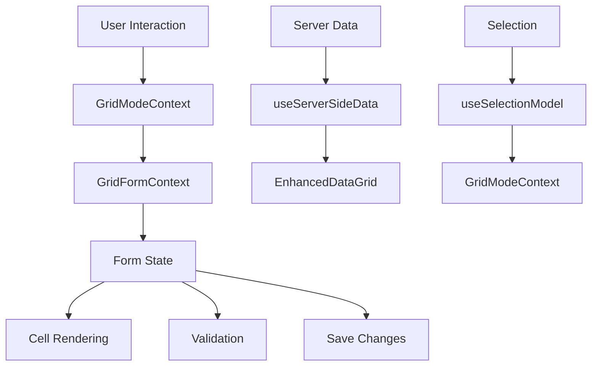

# React DataGrid Codebase Analysis

## Overview

This document provides a comprehensive analysis of the React DataGrid codebase, identifying dead files, documenting data flow, highlighting areas of high complexity, and recommending refactors to improve maintainability and make the code more AI-friendly.

## 1. Dead/Unused Files

### Confirmed Dead Files

These files are not being used and can be safely removed:

1. **`components/DataGrid/context/GridEditingContext.tsx`**
   - Unused context provider
   - Not exported from context/index.ts
   - No components are using this context

2. **`components/DataGrid/hooks/useGridEditing.ts`**
   - Imports from GridEditingContext but not used anywhere
   - Exported from hooks/index.ts but no components are importing it

3. **`components/DataGridDemo.tsx`**
   - Superseded by EnhancedDataGridDemo.tsx
   - Not imported or used anywhere in the application

### Likely Dead Files

These files appear to be unused or superseded by newer implementations:

1. **`components/UnifiedToolbarDataGridDemo.tsx`**
   - Appears to be a demonstration component that's not actively used
   - The main application uses EnhancedDataGridDemo.tsx instead
   - Only referenced in pages/unified-toolbar.tsx which isn't the main entry point

2. **`components/DataGridToolbar.tsx`**
   - Simple toolbar implementation that has been replaced by UnifiedDataGridToolbar
   - Contains commented-out code and alternative icon options
   - Lacks the modal functionality present in UnifiedDataGridToolbar

### Files Needing Implementation or Removal

1. **`components/DataGrid/components/AddRowButton.tsx`**
   - Has functionality commented out with "add row feature deferred"
   - Should either be fully implemented or removed from the UI

### Unused Variables and Imports

Several components contain unused variables or imports that should be cleaned up:

1. In **`EnhancedDataGridDemo.tsx`**:
   - Imports `Box`, `Typography`, `FormControlLabel`, `Switch`, `Chip` but some aren't used
   - Defines handlers like `handleFilter`, `handleRefresh`, etc. that aren't connected to UI

2. In **`components/DataGrid/EnhancedDataGrid.tsx`**:
   - Several props are defined but not used in some code paths

## 2. Data Flow Documentation

### Main Data Flow

The application follows a complex but structured data flow pattern:



### Key Data Flows

#### Editing Flow

1. **Initialization**:
   - EnhancedDataGrid initializes with columns and rows
   - GridFormProvider creates form state for each row when editing begins
   - Each row gets its own form instance with validation rules

2. **Cell Editing**:
   - User double-clicks a cell → Grid enters edit mode
   - `startEditingCell` is called → Creates form instance if needed
   - Cell value changes → `updateCellValue` → Form state updates
   - Validation runs automatically → Errors stored in form state

3. **Saving Changes**:
   - User clicks Save → `saveChanges` in GridFormContext called
   - Changes collected from form state → Grouped into edits and additions
   - `onSave` callback called with changes → Parent component handles API calls
   - Grid returns to view mode

#### Selection Flow

1. **Selection Changes**:
   - User clicks checkbox → `onSelectionModelChange` called
   - Selection model updates → GridModeContext updates
   - UI reflects selection (toolbar shows count, etc.)

2. **Mode Interaction**:
   - Selection mode conflicts with edit/add modes
   - Confirmation dialog shown when switching modes with selection

#### Server-side Data Flow

1. **Initial Load**:
   - Grid initializes → `useServerSideData` hook called if dataUrl provided
   - Initial data fetched → Grid displays data

2. **Pagination/Sorting/Filtering**:
   - User changes page/sort/filter → Respective handlers called
   - New parameters sent to server → New data fetched
   - Grid updates with new data

## 3. Areas of High Complexity

### 1. Form State Management (`GridFormContext.tsx`)

This component has high complexity due to:

- **Multiple Form Instances**: Manages separate form state for each row being edited
- **Custom Validation**: Implements a complex validation system similar to react-hook-form
- **Change Tracking**: Tracks dirty fields and validates in real-time
- **Original Data Preservation**: Maintains original data to support cancellation
- **Asynchronous Updates**: Uses setTimeout for UI updates after state changes

Key complexity points:
- Lines 80-247: Complex form instance creation with validation logic
- Lines 249-808: GridFormProvider with numerous state variables and refs
- Lines 400-437: Complex dirty state tracking logic
- Lines 531-598: Complex save changes logic with edits/additions separation

### 2. Mode Management (`GridModeContext.tsx` and `ToolbarModeContext.tsx`)

Complexity issues:

- **Duplicate Functionality**: Two similar contexts with overlapping responsibilities
- **Mode Conflicts**: Complex logic to handle conflicts between modes
- **Selection Integration**: Complex integration with selection model
- **State Synchronization**: Needs to keep multiple state sources in sync

Key complexity points:
- Both files implement similar functionality with slight differences
- GridModeContext (lines 62-210): Complex provider with multiple state sources
- ToolbarModeContext (lines 59-169): Similar provider with different implementation details

### 3. Cell Rendering and Editing (`EnhancedDataGrid.tsx`)

Complexity issues:

- **Multiple Rendering Paths**: Different rendering for view/edit modes
- **Event Handling**: Complex event handling for cell clicks, double-clicks, keyboard
- **Component Composition**: Multiple wrapper components and providers
- **Conditional Rendering**: Many conditional rendering paths based on state

Key complexity points:
- Lines 104-464: Large component with many responsibilities
- Lines 207-228: Column transformation with render function wrapping
- Lines 234-389: Complex DataGridWithModeControl component
- Lines 391-423: GridFormWrapper with multiple nested providers

### 4. Deep Prop Drilling and Component Nesting

Complexity issues:

- **Deep Component Hierarchy**: Components nested 5+ levels deep
- **Prop Passing**: Props passed through multiple levels
- **Context Overuse**: Multiple contexts with overlapping responsibilities
- **Wrapper Components**: Many small wrapper components adding to mental overhead

## 4. Recommended Refactors

### 1. Consolidate Context System

- **Merge Mode Contexts**: Combine `GridModeContext` and `ToolbarModeContext` into a single context
- **Clearer Separation of Concerns**: 
  - One context for grid state (selection, pagination)
  - One context for editing state (form state, validation)
  - One context for UI state (toolbar, modals)

### 2. Simplify Component Structure

- **Break Down EnhancedDataGrid**:
  - Extract cell rendering logic to separate components
  - Extract toolbar logic to a separate component
  - Create a clearer component hierarchy

- **Proposed Structure**:
  ```
  DataGrid/
  ├── components/
  │   ├── cells/
  │   │   ├── ViewCell.tsx
  │   │   ├── EditCell.tsx
  │   │   └── CellWrapper.tsx
  │   ├── toolbar/
  │   │   ├── Toolbar.tsx
  │   │   ├── ToolbarActions.tsx
  │   │   └── ToolbarStatus.tsx
  │   └── ...
  ├── contexts/
  │   ├── GridStateContext.tsx
  │   ├── EditingContext.tsx
  │   └── UIContext.tsx
  ├── hooks/
  │   ├── useGridState.ts
  │   ├── useEditing.ts
  │   └── ...
  └── DataGrid.tsx
  ```

### 3. Improve State Management

- **Consider Using a State Management Library**:
  - Redux Toolkit for complex state
  - Zustand for simpler state management
  - React Query for server state

- **Normalize State Structure**:
  - Store rows by ID in a map/object
  - Store selection as a set of IDs
  - Store editing state separately from data

### 4. Standardize Validation

- **Extract Validation Logic**:
  - Move validation out of form state management
  - Create reusable validation functions
  - Consider using a validation library (Zod, Yup)

- **Validation Pipeline**:
  - Field-level validation
  - Row-level validation
  - Cross-field validation

### 5. Improve Type Safety

- **Reduce `any` Types**:
  - Replace `any` with specific types
  - Use generics for reusable components
  - Create type guards for runtime type checking

- **Type Definitions**:
  - Create a comprehensive type system for grid data
  - Define clear interfaces for all components
  - Use discriminated unions for state

## 5. Implementation Plan

### Phase 1: Documentation and Cleanup

1. **Add Inline Comments**:
   - Document complex logic in GridFormContext
   - Document data flow in EnhancedDataGrid
   - Document mode management in GridModeContext

2. **Remove Dead Files**:
   - Remove confirmed dead files
   - Verify and remove likely dead files
   - Clean up unused imports and variables

### Phase 2: Refactoring

1. **Context Consolidation**:
   - Create new context structure
   - Migrate functionality from old contexts
   - Update components to use new contexts

2. **Component Restructuring**:
   - Break down EnhancedDataGrid
   - Create new component hierarchy
   - Update imports and references

### Phase 3: Improvements

1. **State Management**:
   - Implement normalized state structure
   - Improve state update patterns
   - Reduce unnecessary re-renders

2. **Validation System**:
   - Extract validation logic
   - Create reusable validation functions
   - Implement validation pipeline

3. **Type Safety**:
   - Add specific types
   - Replace `any` types
   - Add type guards

## 6. Specific Code Improvements

### EnhancedDataGridDemo.tsx

```typescript
// Current issues:
// - Unused imports
// - Handlers defined but not connected to UI
// - Unclear data flow

// Recommended changes:
// - Remove unused imports
// - Document the purpose of each handler
// - Add comments explaining the data flow
// - Consider moving handlers to a custom hook
```

### GridFormContext.tsx

```typescript
// Current issues:
// - Very large file (800+ lines)
// - Complex state management
// - Multiple responsibilities

// Recommended changes:
// - Split into multiple files
// - Extract form instance creation to separate file
// - Extract validation logic to separate file
// - Add comments explaining the data flow
```

### EnhancedDataGrid.tsx

```typescript
// Current issues:
// - Very large component
// - Multiple nested components
// - Complex rendering logic

// Recommended changes:
// - Extract nested components to separate files
// - Add comments explaining the rendering flow
// - Simplify props passing
```

## Conclusion

The React DataGrid codebase is well-structured but has grown complex over time. By implementing the recommendations in this document, the codebase can become more maintainable, easier to understand, and more AI-friendly. The key focus areas should be:

1. Removing dead code
2. Documenting complex logic
3. Simplifying the component hierarchy
4. Improving state management
5. Enhancing type safety

These improvements will make the codebase more maintainable and easier to extend in the future.