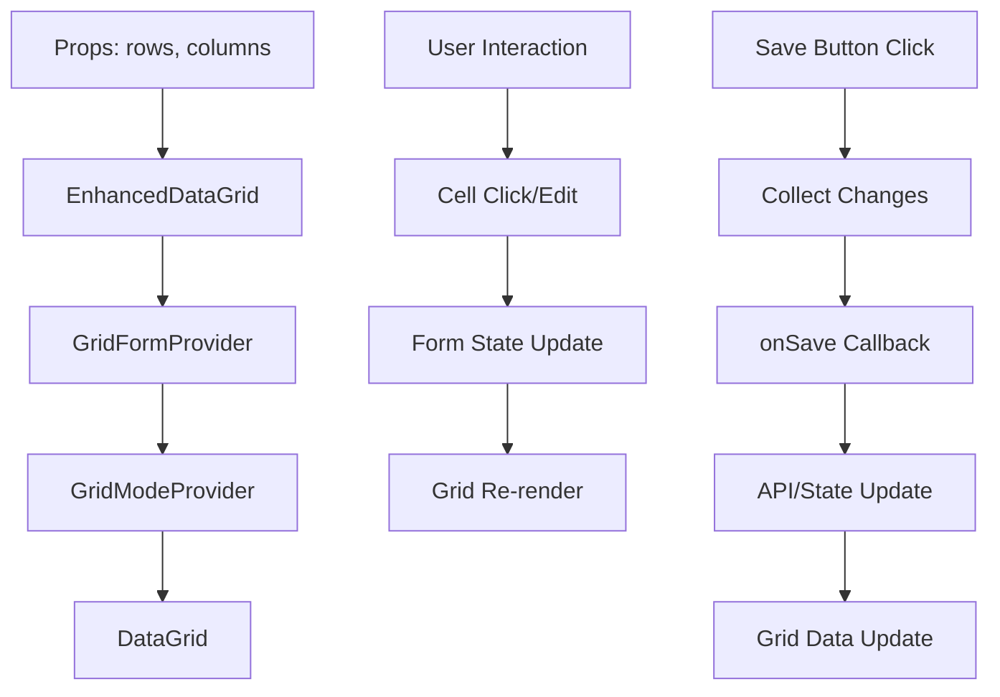
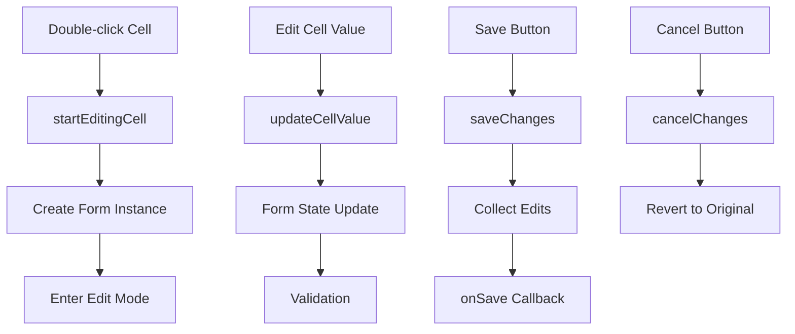
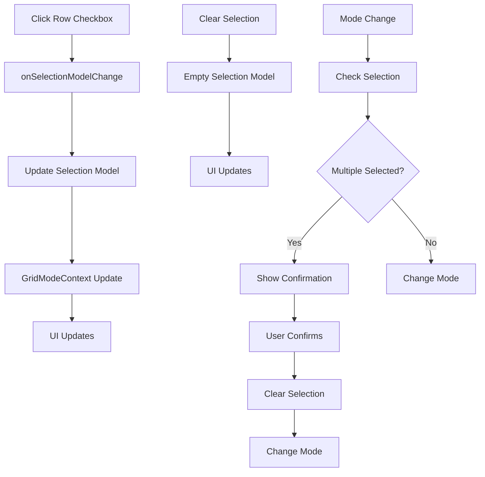
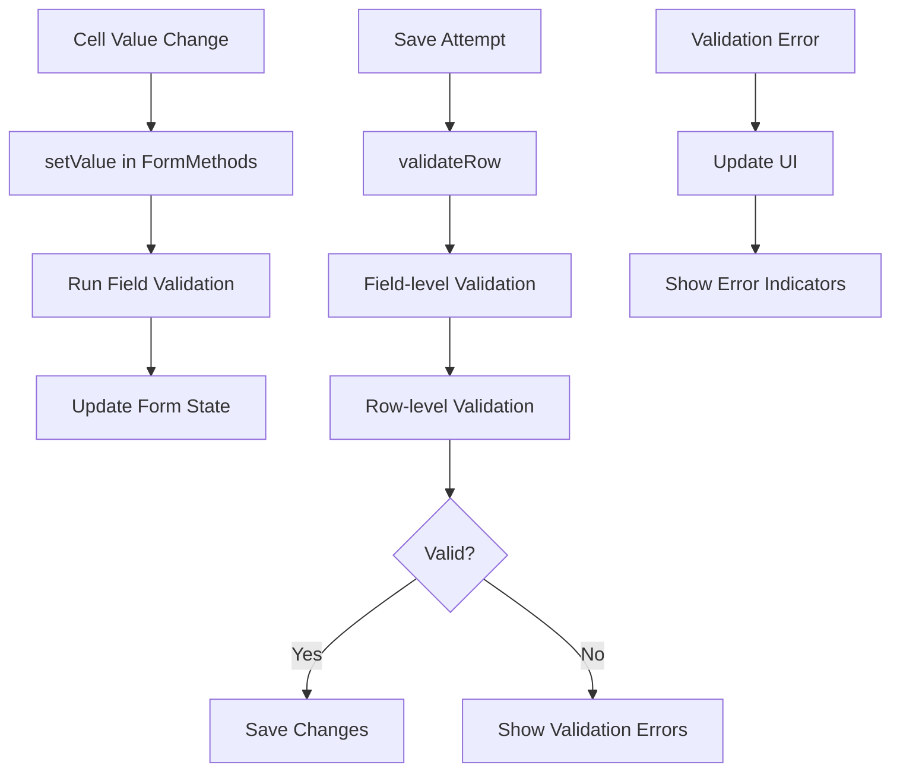
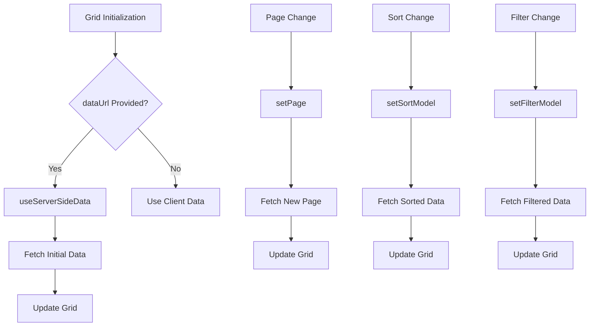
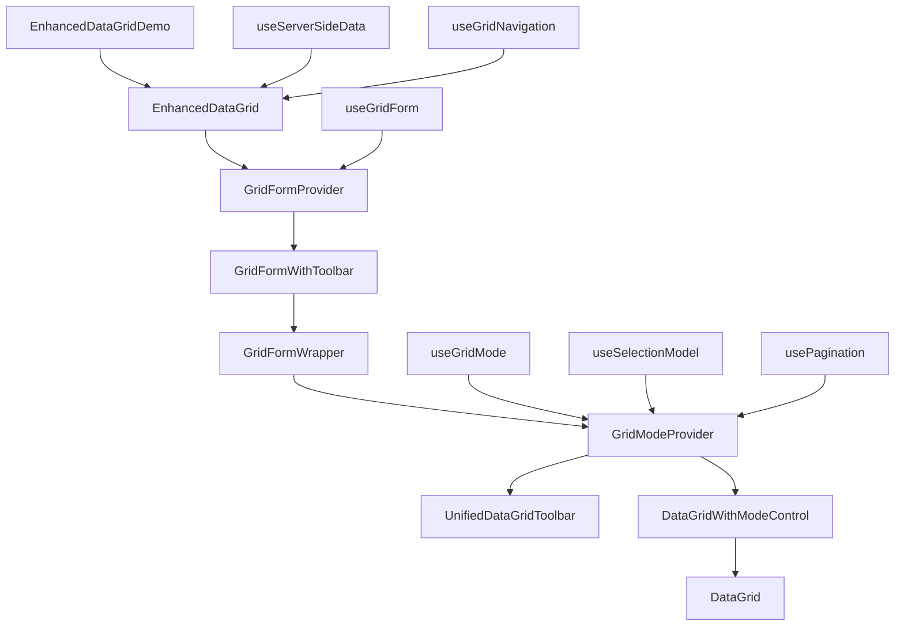

# Data Flow Documentation for React DataGrid

This document provides a detailed explanation of how data flows through the React DataGrid components, focusing on the key paths and state transformations.

## Overview

The React DataGrid application has several key data flows:

1. **Grid Data Flow**: How row data is loaded, displayed, and updated
2. **Editing Flow**: How cell editing works from user interaction to state updates
3. **Selection Flow**: How row selection is managed
4. **Validation Flow**: How data validation works
5. **Server-side Data Flow**: How data is fetched from the server

## 1. Grid Data Flow

### Detailed Steps:

1. **Initialization**:
   - `EnhancedDataGridDemo` provides initial `rows` and `columns` data
   - `EnhancedDataGrid` receives this data and sets up the grid
   - Data is passed to MUI X DataGrid for rendering

2. **Data Display**:
   - Each row is rendered using the column definitions
   - Custom cell renderers handle different data types
   - View mode shows formatted data

3. **Data Updates**:
   - When changes are saved, they're collected from form state
   - Changes are passed to the parent via `onSave` callback
   - Parent component is responsible for API calls or state updates
   - Grid is updated with new data when props change

## 2. Editing Flow

### Detailed Steps:

1. **Starting Edit Mode**:
   - User double-clicks a cell
   - `startEditingCell` is called in `GridFormContext`
   - If row isn't being edited, `startEditingRow` creates a form instance
   - Cell enters edit mode and shows edit component

2. **Editing Values**:
   - User changes cell value
   - `updateCellValue` is called
   - Form state is updated with new value
   - Validation runs if configured
   - UI updates to show validation state

3. **Saving Changes**:
   - User clicks Save button
   - `saveChanges` collects all changes from form state
   - Changes are grouped into edits (existing rows) and additions (new rows)
   - `onSave` callback is called with changes
   - Grid returns to view mode

4. **Canceling Changes**:
   - User clicks Cancel button
   - `cancelChanges` reverts all changes
   - Original data is restored from `originalDataRef`
   - Grid returns to view mode

## 3. Selection Flow

### Detailed Steps:

1. **Selecting Rows**:
   - User clicks row checkbox
   - `onSelectionModelChange` is called
   - Selection model is updated in `useSelectionModel` hook
   - `GridModeContext` reflects selection count
   - Toolbar updates to show selection count

2. **Mode Interaction**:
   - When user tries to change mode with multiple rows selected
   - Confirmation dialog is shown
   - If confirmed, selection is cleared and mode changes
   - If canceled, selection remains and mode doesn't change

3. **Selection Restrictions**:
   - Selection is disabled in edit and add modes
   - When returning to select mode, previous selection is lost

## 4. Validation Flow

### Detailed Steps:

1. **Field Validation**:
   - When cell value changes, `setValue` is called
   - Validation rules from column definition are applied
   - Validation results are stored in form state
   - UI updates to show validation state

2. **Row Validation**:
   - When saving, `validateRow` is called for each edited row
   - First, all field validations are run
   - Then, row-level validation function is called if provided
   - Results are combined and stored in form state

3. **Validation UI**:
   - `ValidationIndicator` component shows validation state
   - Invalid fields are highlighted with red border
   - Tooltips show validation error messages
   - Save button is disabled if there are validation errors

## 5. Server-side Data Flow

### Detailed Steps:

1. **Initial Data Load**:
   - If `dataUrl` is provided, `useServerSideData` hook is used
   - Initial data is fetched from server
   - Grid displays server data

2. **Pagination**:
   - User changes page
   - `setPage` is called in `useServerSideData`
   - New data is fetched with updated page parameter
   - Grid updates with new data

3. **Sorting and Filtering**:
   - User changes sort or filter
   - Respective handlers update sort/filter models
   - New data is fetched with updated parameters
   - Grid updates with new data

## Component Interaction

The following diagram shows how the different components interact with each other:

## State Management

The application uses a combination of React context and hooks for state management:

1. **GridFormContext**: Manages form state for editing
   - Form instances for each row
   - Validation state
   - Dirty state tracking
   - Original data preservation

2. **GridModeContext**: Manages grid mode
   - Current mode (none, edit, add, select)
   - Selection state
   - Editing state
   - Action handlers

3. **Custom Hooks**:
   - `useSelectionModel`: Manages row selection
   - `usePagination`: Manages pagination state
   - `useServerSideData`: Manages server data fetching
   - `useGridNavigation`: Manages keyboard navigation

## Data Transformation

Data undergoes several transformations as it flows through the application:

1. **Input Data** → **Grid Data**:
   - Column definitions are enhanced with field configs
   - Rows are prepared for display

2. **Grid Data** → **Form Data**:
   - When editing starts, grid data is copied to form state
   - Original data is preserved for cancellation

3. **Form Data** → **Validated Data**:
   - Form data is validated according to rules
   - Validation errors are tracked

4. **Form Data** → **Output Data**:
   - When saving, form data is collected
   - Changes are extracted by comparing with original data
   - Output is formatted as edits and additions

## Conclusion

The data flow in the React DataGrid application is complex but well-structured. Understanding these flows is essential for maintaining and extending the application. The key points to remember are:

1. Data flows from props to grid to form state and back
2. Editing is managed through a custom form state system
3. Validation happens at both field and row levels
4. Selection and editing modes have complex interactions
5. Server-side data is managed through dedicated hooks

By following these data flows, you can understand how changes in one part of the application affect other parts, making it easier to debug issues and implement new features.