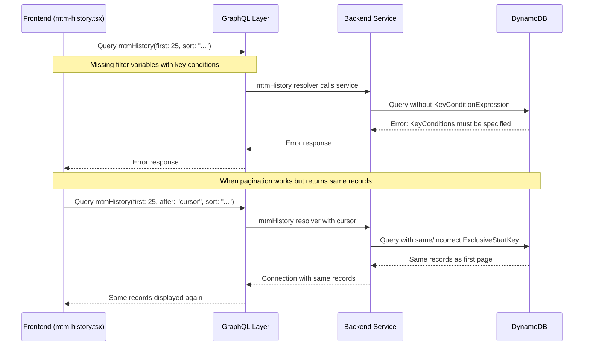
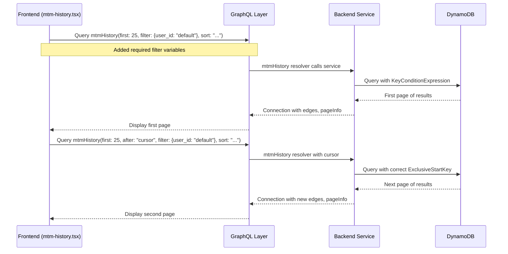
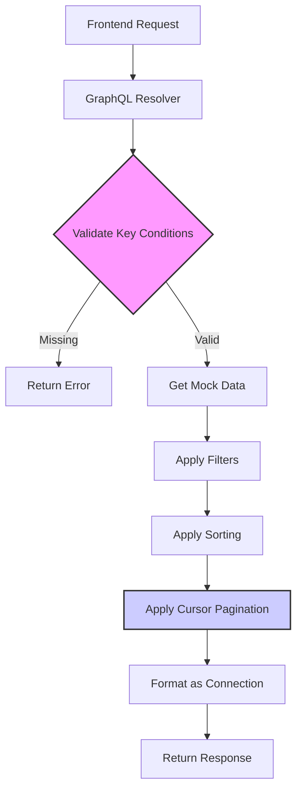
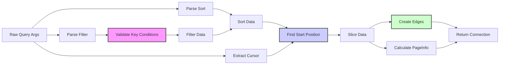

# MTM History Pagination Data Flow

This document visualizes the data flow for the MTM History pagination implementation and highlights where the current issues occur.

## Current Flow (With Issues)

## Proposed Solution Flow

## Mock Implementation Architecture

## Data Transformation Flow

## Key Components and Responsibilities

### Frontend (`pages/mtm-history.tsx`)
- Provide required filter variables with key conditions
- Pass the GraphQL query and variables to EnhancedDataGridGraphQL
- Handle UI interactions and display

### GraphQL Resolver (`graphql/resolvers/mtm-history.ts`)
- Parse and validate query arguments
- Enforce key condition requirements
- Apply filtering, sorting, and pagination
- Format response as a Relay Connection

### Mock Data Service
- Generate and cache mock MTM history data
- Simulate DynamoDB behavior for testing
- Implement cursor-based pagination logic

### DynamoDB Pagination Service (Real Implementation)
- Build proper KeyConditionExpression from filter
- Handle cursor-based pagination with ExclusiveStartKey
- Apply additional filtering and sorting
- Return consistent Connection structure