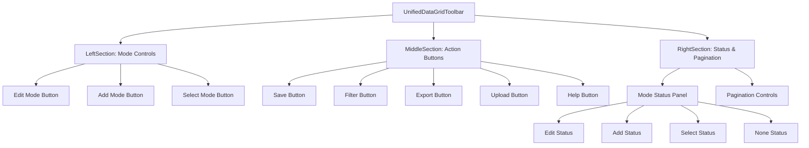
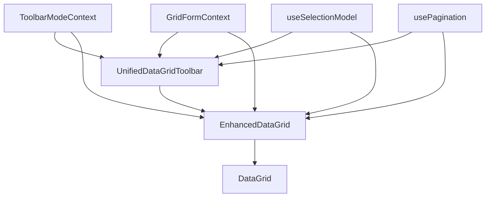

# Unified DataGrid Toolbar Design

## Overview

This document outlines the design for a unified toolbar that integrates existing functionality with new modal features for editing, adding, and selection status. The toolbar will enforce a modal approach where only one mode can be active at a time.

## Requirements

1. The toolbar should have different modes (none, edit, add, select) where only one can be active at a time
2. When in edit mode:
   - The add button should be disabled
   - All other toolbar buttons (filter, export, etc.) should be disabled
   - Row selection checkboxes should be disabled
3. When in add mode:
   - Cell editing should be disabled for existing rows
   - All other toolbar buttons (filter, export, etc.) should be disabled
   - Row selection checkboxes should be disabled
4. Only show confirmation when switching from selection mode with more than 1 row selected
5. The status panel should be integrated into the toolbar and show different content based on the current mode
6. Pagination controls should be on the right side of the toolbar

## Component Structure



## State Management

We'll create a new context to manage the modal state of the toolbar:

```typescript
// ToolbarModeContext.tsx
type ToolbarMode = 'none' | 'edit' | 'add' | 'select';

interface ToolbarModeContextType {
  // Mode state
  mode: ToolbarMode;
  setMode: (newMode: ToolbarMode) => void;
  
  // Selection state
  selectedRowCount: number;
  clearSelection: () => void;
  
  // Edit state
  editingRowCount: number;
  isAddingRow: boolean;
  hasValidationErrors: boolean;
  
  // Actions
  saveChanges: () => void;
  cancelChanges: () => void;
  addRow: () => void;
  
  // Pagination
  page: number;
  pageSize: number;
  totalRows: number;
  setPage: (page: number) => void;
  setPageSize: (pageSize: number) => void;
}
```

This context will integrate with the existing GridFormContext and handle the modal behavior.

## Mode Status Panel

The Mode Status Panel will change based on the current mode:

### Edit Mode Status
- Shows number of records being edited
- Shows validation status
- Provides save/cancel buttons

### Add Mode Status
- Shows "Adding new record" status
- Shows validation status
- Provides save/cancel buttons

### Select Mode Status
- Shows number of selected rows
- Provides actions for selected rows (e.g., delete, export)

### None Mode Status
- Shows basic information or is hidden

## Modal Behavior Implementation

```typescript
// Handle mode switching with confirmation when needed
const handleModeSwitch = (newMode: ToolbarMode) => {
  // If in selection mode with multiple rows selected, show confirmation
  if (mode === 'select' && selectedRowCount > 1 && newMode !== 'select') {
    setConfirmationDialogOpen(true);
    setTargetMode(newMode);
    return;
  }
  
  // Otherwise, switch mode directly
  setMode(newMode);
};

// Determine button disabled states based on current mode
const isInEditOrAddMode = mode === 'edit' || mode === 'add';
const isAddButtonDisabled = mode === 'edit';
const isEditingEnabled = mode !== 'add';
const isSelectionEnabled = !isInEditOrAddMode;

// Disable all action buttons when in edit or add mode
const areActionButtonsDisabled = isInEditOrAddMode;
```

## Confirmation Dialog

```typescript
// Confirmation dialog for switching from selection mode
<Dialog open={confirmationDialogOpen} onClose={() => setConfirmationDialogOpen(false)}>
  <DialogTitle>Confirm Mode Switch</DialogTitle>
  <DialogContent>
    <DialogContentText>
      You have {selectedRowCount} rows selected. Switching to {targetMode} mode will clear your selection. Do you want to continue?
    </DialogContentText>
  </DialogContent>
  <DialogActions>
    <Button onClick={() => setConfirmationDialogOpen(false)}>Cancel</Button>
    <Button 
      onClick={() => {
        setMode(targetMode);
        clearSelection();
        setConfirmationDialogOpen(false);
      }} 
      color="primary"
    >
      Continue
    </Button>
  </DialogActions>
</Dialog>
```

## Integration with Existing Components

The unified toolbar will need to integrate with:

1. **GridFormContext**: For editing state, validation, and save/cancel actions
2. **useSelectionModel**: For selection state and actions
3. **usePagination**: For pagination state and controls
4. **DataGrid**: To control cell editing and row selection based on mode

## Component Implementation

### UnifiedDataGridToolbar Component

```typescript
import React, { useState } from 'react';
import {
  Box,
  IconButton,
  Tooltip,
  ToggleButtonGroup,
  ToggleButton,
  Typography,
  Dialog,
  DialogTitle,
  DialogContent,
  DialogContentText,
  DialogActions,
  Button,
  Chip,
  Select,
  MenuItem,
  Paper,
} from '@mui/material';

// Mode icons
import EditIcon from '@mui/icons-material/Edit';
import AddIcon from '@mui/icons-material/Add';
import SelectAllIcon from '@mui/icons-material/SelectAll';

// Pagination icons
import ChevronLeftIcon from '@mui/icons-material/ChevronLeft';
import ChevronRightIcon from '@mui/icons-material/ChevronRight';

// Existing toolbar icons
import SaveIcon from '@mui/icons-material/Save';
import FilterAltIcon from '@mui/icons-material/FilterAlt';
import FileDownloadIcon from '@mui/icons-material/FileDownload';
import UploadIcon from '@mui/icons-material/Upload';
import HelpIcon from '@mui/icons-material/Help';
import CloseIcon from '@mui/icons-material/Close';

// Context and hooks
import { useToolbarMode } from '../context/ToolbarModeContext';
import { useGridForm } from '../context/GridFormContext';

interface UnifiedDataGridToolbarProps {
  onSave?: () => void;
  onFilter?: () => void;
  onExport?: () => void;
  onUpload?: () => void;
  onHelp?: () => void;
}

export const UnifiedDataGridToolbar: React.FC<UnifiedDataGridToolbarProps> = ({
  onSave,
  onFilter,
  onExport,
  onUpload,
  onHelp
}) => {
  // Get toolbar mode context
  const {
    mode,
    setMode,
    selectedRowCount,
    clearSelection,
    editingRowCount,
    isAddingRow,
    hasValidationErrors,
    saveChanges,
    cancelChanges,
    addRow,
    page,
    pageSize,
    totalRows,
    setPage,
    setPageSize
  } = useToolbarMode();

  // State for confirmation dialog
  const [confirmationDialogOpen, setConfirmationDialogOpen] = useState(false);
  const [targetMode, setTargetMode] = useState<'none' | 'edit' | 'add' | 'select'>('none');

  // Handle mode switching with confirmation when needed
  const handleModeSwitch = (newMode: 'none' | 'edit' | 'add' | 'select') => {
    // If in selection mode with multiple rows selected, show confirmation
    if (mode === 'select' && selectedRowCount > 1 && newMode !== 'select') {
      setConfirmationDialogOpen(true);
      setTargetMode(newMode);
      return;
    }
    
    // Otherwise, switch mode directly
    setMode(newMode);
  };

  // Determine button disabled states based on current mode
  const isInEditOrAddMode = mode === 'edit' || mode === 'add';
  const isAddButtonDisabled = mode === 'edit';
  const areActionButtonsDisabled = isInEditOrAddMode;

  return (
    <Box sx={{ 
      display: 'flex', 
      justifyContent: 'space-between',
      alignItems: 'center',
      padding: 1,
      borderBottom: '1px solid #e0e0e0'
    }}>
      {/* Left Section: Mode Controls */}
      <Box sx={{ display: 'flex', alignItems: 'center' }}>
        <ToggleButtonGroup
          value={mode}
          exclusive
          onChange={(_, newMode) => {
            if (newMode !== null) {
              handleModeSwitch(newMode);
            }
          }}
          size="small"
        >
          <ToggleButton value="edit" disabled={isAddingRow}>
            <EditIcon fontSize="small" />
            <Typography variant="body2" sx={{ ml: 0.5 }}>Edit</Typography>
          </ToggleButton>
          <ToggleButton value="add" disabled={isAddButtonDisabled}>
            <AddIcon fontSize="small" />
            <Typography variant="body2" sx={{ ml: 0.5 }}>Add</Typography>
          </ToggleButton>
          <ToggleButton value="select">
            <SelectAllIcon fontSize="small" />
            <Typography variant="body2" sx={{ ml: 0.5 }}>Select</Typography>
          </ToggleButton>
        </ToggleButtonGroup>
      </Box>

      {/* Middle Section: Action Buttons */}
      <Box sx={{ 
        display: 'flex', 
        justifyContent: 'center',
        gap: 1
      }}>
        {/* Save Options */}
        <Tooltip title="Save">
          <span>
            <IconButton onClick={onSave} disabled={areActionButtonsDisabled}>
              <SaveIcon />
            </IconButton>
          </span>
        </Tooltip>

        {/* Filter Options */}
        <Tooltip title="Filter">
          <span>
            <IconButton onClick={onFilter} disabled={areActionButtonsDisabled}>
              <FilterAltIcon />
            </IconButton>
          </span>
        </Tooltip>

        {/* Export Options */}
        <Tooltip title="Export">
          <span>
            <IconButton onClick={onExport} disabled={areActionButtonsDisabled}>
              <FileDownloadIcon />
            </IconButton>
          </span>
        </Tooltip>

        {/* Upload Options */}
        <Tooltip title="Upload">
          <span>
            <IconButton onClick={onUpload} disabled={areActionButtonsDisabled}>
              <UploadIcon />
            </IconButton>
          </span>
        </Tooltip>

        {/* Help Options */}
        <Tooltip title="Help">
          <span>
            <IconButton onClick={onHelp} disabled={areActionButtonsDisabled}>
              <HelpIcon />
            </IconButton>
          </span>
        </Tooltip>
      </Box>

      {/* Right Section: Status & Pagination */}
      <Box sx={{ 
        display: 'flex', 
        alignItems: 'center',
        gap: 2
      }}>
        {/* Mode Status Panel */}
        {mode !== 'none' && (
          <Paper
            elevation={0}
            sx={{
              display: 'flex',
              alignItems: 'center',
              gap: 1,
              padding: '4px 8px',
              borderRadius: 1,
              backgroundColor: mode === 'edit' ? 'rgba(25, 118, 210, 0.08)' : 
                              mode === 'add' ? 'rgba(46, 125, 50, 0.08)' : 
                              'rgba(237, 108, 2, 0.08)'
            }}
          >
            {/* Status content based on mode */}
            {mode === 'edit' && (
              <>
                <Typography variant="body2">
                  Editing {editingRowCount} record{editingRowCount !== 1 ? 's' : ''}
                </Typography>
                {hasValidationErrors && (
                  <Chip 
                    label="Validation errors" 
                    size="small" 
                    color="warning" 
                    sx={{ height: 24 }}
                  />
                )}
                <Tooltip title="Save changes">
                  <IconButton size="small" onClick={saveChanges} disabled={hasValidationErrors}>
                    <SaveIcon fontSize="small" />
                  </IconButton>
                </Tooltip>
                <Tooltip title="Cancel changes">
                  <IconButton size="small" onClick={cancelChanges}>
                    <CloseIcon fontSize="small" />
                  </IconButton>
                </Tooltip>
              </>
            )}
            
            {mode === 'add' && (
              <>
                <Typography variant="body2">
                  Adding new record
                </Typography>
                {hasValidationErrors && (
                  <Chip 
                    label="Validation errors" 
                    size="small" 
                    color="warning" 
                    sx={{ height: 24 }}
                  />
                )}
                <Tooltip title="Save changes">
                  <IconButton size="small" onClick={saveChanges} disabled={hasValidationErrors}>
                    <SaveIcon fontSize="small" />
                  </IconButton>
                </Tooltip>
                <Tooltip title="Cancel changes">
                  <IconButton size="small" onClick={cancelChanges}>
                    <CloseIcon fontSize="small" />
                  </IconButton>
                </Tooltip>
              </>
            )}
            
            {mode === 'select' && (
              <>
                <Typography variant="body2">
                  {selectedRowCount} row{selectedRowCount !== 1 ? 's' : ''} selected
                </Typography>
                <Tooltip title="Clear selection">
                  <IconButton size="small" onClick={clearSelection}>
                    <CloseIcon fontSize="small" />
                  </IconButton>
                </Tooltip>
              </>
            )}
          </Paper>
        )}

        {/* Pagination Controls */}
        <Box sx={{ display: 'flex', alignItems: 'center', gap: 1 }}>
          <Typography variant="body2">
            Page {page + 1} of {Math.ceil(totalRows / pageSize)}
          </Typography>
          <IconButton 
            size="small"
            disabled={page === 0} 
            onClick={() => setPage(page - 1)}
          >
            <ChevronLeftIcon fontSize="small" />
          </IconButton>
          <IconButton 
            size="small"
            disabled={page >= Math.ceil(totalRows / pageSize) - 1} 
            onClick={() => setPage(page + 1)}
          >
            <ChevronRightIcon fontSize="small" />
          </IconButton>
          <Select
            value={pageSize}
            onChange={(e) => setPageSize(Number(e.target.value))}
            size="small"
            sx={{ height: 28, minWidth: 80 }}
          >
            {[10, 25, 50, 100].map((size) => (
              <MenuItem key={size} value={size}>
                {size} rows
              </MenuItem>
            ))}
          </Select>
        </Box>
      </Box>

      {/* Confirmation Dialog */}
      <Dialog 
        open={confirmationDialogOpen} 
        onClose={() => setConfirmationDialogOpen(false)}
      >
        <DialogTitle>Confirm Mode Switch</DialogTitle>
        <DialogContent>
          <DialogContentText>
            You have {selectedRowCount} rows selected. Switching to {targetMode} mode will clear your selection. Do you want to continue?
          </DialogContentText>
        </DialogContent>
        <DialogActions>
          <Button onClick={() => setConfirmationDialogOpen(false)}>Cancel</Button>
          <Button 
            onClick={() => {
              setMode(targetMode);
              clearSelection();
              setConfirmationDialogOpen(false);
            }} 
            color="primary"
          >
            Continue
          </Button>
        </DialogActions>
      </Dialog>
    </Box>
  );
};
```

### ToolbarModeContext

```typescript
import React, { createContext, useContext, useState, useCallback } from 'react';
import { useGridForm } from './GridFormContext';
import { useSelectionModel } from '../hooks/useSelectionModel';
import { usePagination } from '../hooks/usePagination';

// Define the toolbar mode type
type ToolbarMode = 'none' | 'edit' | 'add' | 'select';

// Define the context type
interface ToolbarModeContextType {
  // Mode state
  mode: ToolbarMode;
  setMode: (newMode: ToolbarMode) => void;
  
  // Selection state
  selectedRowCount: number;
  clearSelection: () => void;
  
  // Edit state
  editingRowCount: number;
  isAddingRow: boolean;
  hasValidationErrors: boolean;
  
  // Actions
  saveChanges: () => void;
  cancelChanges: () => void;
  addRow: () => void;
  
  // Pagination
  page: number;
  pageSize: number;
  totalRows: number;
  setPage: (page: number) => void;
  setPageSize: (pageSize: number) => void;
}

// Create the context
const ToolbarModeContext = createContext<ToolbarModeContextType | undefined>(undefined);

// Provider props
interface ToolbarModeProviderProps {
  children: React.ReactNode;
  totalRows: number;
}

// Provider component
export const ToolbarModeProvider: React.FC<ToolbarModeProviderProps> = ({ 
  children,
  totalRows
}) => {
  // State for the current mode
  const [mode, setMode] = useState<ToolbarMode>('none');
  
  // Get form context
  const { 
    saveChanges: formSaveChanges,
    cancelChanges: formCancelChanges,
    addRow: formAddRow,
    hasValidationErrors,
    editingRows
  } = useGridForm();
  
  // Get selection model
  const { 
    selectionModel,
    onSelectionModelChange
  } = useSelectionModel();
  
  // Get pagination
  const {
    page,
    pageSize,
    setPage,
    setPageSize
  } = usePagination();
  
  // Derived state
  const selectedRowCount = selectionModel.length;
  const editingRowCount = editingRows.size;
  const isAddingRow = Array.from(editingRows).some(rowId => {
    // Check if this is a newly added row (implementation depends on how you track added rows)
    return typeof rowId === 'string' && rowId.startsWith('new-');
  });
  
  // Clear selection
  const clearSelection = useCallback(() => {
    onSelectionModelChange([], { api: null });
  }, [onSelectionModelChange]);
  
  // Save changes
  const saveChanges = useCallback(() => {
    formSaveChanges();
    setMode('none');
  }, [formSaveChanges]);
  
  // Cancel changes
  const cancelChanges = useCallback(() => {
    formCancelChanges();
    setMode('none');
  }, [formCancelChanges]);
  
  // Add row
  const addRow = useCallback(() => {
    formAddRow();
    setMode('add');
  }, [formAddRow]);
  
  // Context value
  const contextValue: ToolbarModeContextType = {
    mode,
    setMode,
    selectedRowCount,
    clearSelection,
    editingRowCount,
    isAddingRow,
    hasValidationErrors,
    saveChanges,
    cancelChanges,
    addRow,
    page,
    pageSize,
    totalRows,
    setPage,
    setPageSize
  };
  
  return (
    <ToolbarModeContext.Provider value={contextValue}>
      {children}
    </ToolbarModeContext.Provider>
  );
};

// Hook to use the context
export const useToolbarMode = () => {
  const context = useContext(ToolbarModeContext);
  if (!context) {
    throw new Error('useToolbarMode must be used within a ToolbarModeProvider');
  }
  return context;
};
```

## Integration with EnhancedDataGrid

The EnhancedDataGrid component will need to be updated to:

1. Wrap its children with the ToolbarModeProvider
2. Replace the existing toolbar with the UnifiedDataGridToolbar
3. Pass the appropriate props to control the modal behavior
4. Disable row selection checkboxes when in edit or add mode
5. Disable cell editing when in add mode for existing rows

```typescript
// In EnhancedDataGrid.tsx

// Add the UnifiedDataGridToolbar
import { UnifiedDataGridToolbar } from './components/UnifiedDataGridToolbar';
import { ToolbarModeProvider, useToolbarMode } from './context/ToolbarModeContext';

// Inside the component
return (
  <ToolbarModeProvider totalRows={totalRows}>
    <GridFormProvider
      columns={columns}
      initialRows={displayRows}
      onSave={onSave}
      validateRow={validateRow}
      isCompact={isCompact}
    >
      <div className={`h-full w-full flex flex-col ${className || ''}`}>
        {/* Replace the existing toolbar and header with the unified toolbar */}
        <UnifiedDataGridToolbar
          onSave={onSave}
          onFilter={onFilter}
          onExport={onExport}
          onUpload={onUpload}
          onHelp={onHelp}
        />
        
        <Paper elevation={0} className="flex-grow w-full overflow-auto">
          <CellEditHandler apiRef={apiRef} />
          <DataGridWithModeControl
            apiRef={apiRef}
            rows={displayRows}
            columns={gridColumns}
            // ... other props
          />
        </Paper>
      </div>
    </GridFormProvider>
  </ToolbarModeProvider>
);

// Create a wrapper component to access the mode context
const DataGridWithModeControl = (props) => {
  const { mode } = useToolbarMode();
  
  // Determine if row selection should be disabled
  const isInEditOrAddMode = mode === 'edit' || mode === 'add';
  
  return (
    <DataGrid
      {...props}
      checkboxSelection={props.checkboxSelection && !isInEditOrAddMode}
      disableRowSelectionOnClick={isInEditOrAddMode || props.disableRowSelectionOnClick}
      onCellClick={(params) => {
        // Disable cell editing when in add mode for existing rows
        if (mode === 'add' && !params.id.toString().startsWith('new-')) {
          return;
        }
        
        // Original cell click handler
        if (params.field !== '__check__' && params.field !== '__actions__') {
          const { id, field } = params;
          const column = props.columns.find(col => col.field === field);
          if (column?.editable !== false) {
            try {
              const cellMode = props.apiRef.current.getCellMode(id, field);
              if (cellMode === 'view') {
                props.apiRef.current.startCellEditMode({ id, field });
              }
            } catch (error) {
              console.error('Error starting cell edit mode:', error);
            }
          }
        }
      }}
    />
  );
};
```

## Data Flow Diagram



## Implementation Plan

1. Create the `ToolbarModeContext.tsx` file
2. Create the `UnifiedDataGridToolbar.tsx` component
3. Update the `EnhancedDataGrid.tsx` component to use the new toolbar and context
4. Update the `GridFormContext.tsx` to expose the necessary state and methods
5. Update the `useSelectionModel.ts` hook to support clearing selection
6. Test the implementation with various scenarios:
   - Switching between modes
   - Editing rows
   - Adding rows
   - Selecting rows
   - Pagination