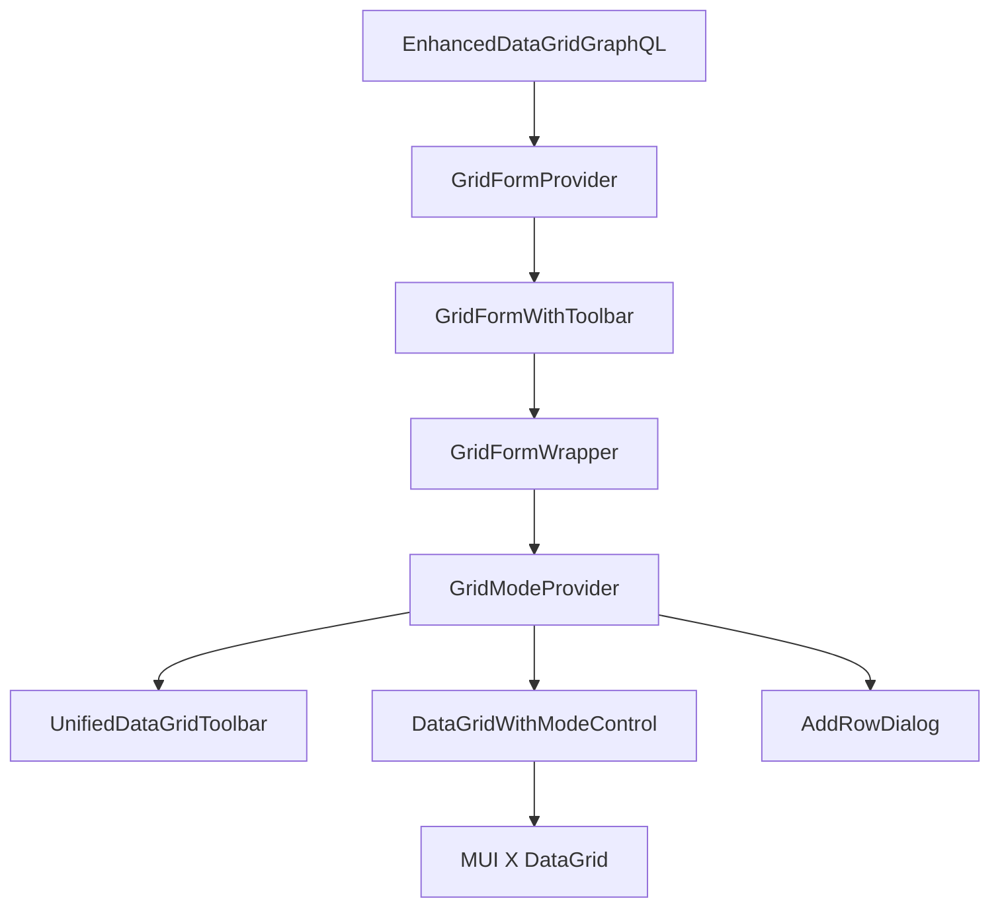
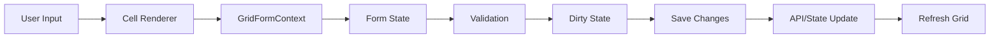

# Enhanced DataGrid Documentation Proposal

Based on my analysis of the project code and documentation, I've developed a comprehensive documentation plan that reflects the current architecture and features while maintaining a concise, technical style. The documentation is structured to progressively introduce concepts from basic to advanced.

# Documentation Structure

## Documentation Organization

The documentation is organized into the following main categories:

1. **Core Architecture**: Essential understanding of the component structure
2. **Data Management**: How data is managed, fetched, and synchronized
3. **User Interaction**: Modal behavior, editing, and event handling
4. **Customization**: Extending and configuring the component
5. **API Reference**: Comprehensive property and method documentation

## Documentation Deliverables

### 1. Architecture Overview

**Filename**: `architecture-overview.md`

This document provides a high-level overview of the component architecture, including component hierarchy, state management, and data flow.

```markdown
# DataGrid Architecture Overview

## Component Hierarchy



## State Management System

The DataGrid uses three primary state management systems:

1. **Form State** (`GridFormContext`): Manages form state for rows being edited
   - Each row has its own form instance
   - Tracks changes, validation, and dirty state
   - Handles saving and canceling changes

2. **Mode State** (`GridModeContext`): Manages the UI mode
   - Controls the current mode (none, edit, add, select)
   - Manages selection state
   - Handles capabilities (can edit, can add, can select, can delete)

3. **Data Fetching** (`useGraphQLData`): Manages server-side data
   - Handles pagination, sorting, and filtering
   - Manages data transformation
   - Provides refetch capabilities

## Data Flow



## Master Hook Architecture

The component uses a "master hook" architecture where core functionality is composed from smaller, focused hooks:

1. `useEnhancedDataGrid`: Master hook that composes other hooks
2. `useGraphQLData`: Manages GraphQL data fetching
3. `useSelectionModel`: Manages row selection
4. `usePagination`: Manages pagination state
```

### 2. Key Contexts and Hooks

**Filename**: `contexts-and-hooks.md`

This document explains the core contexts and hooks that power the DataGrid.

```markdown
# Key Contexts and Hooks

## GridFormContext

The GridFormContext manages form state for rows being edited. It creates and manages form instances for each row, handles validation, and tracks changes.

### Key Features

- **Form Instance Management**: Creates and stores form instances for each row
- **Value Tracking**: Tracks changes to field values
- **Validation**: Validates field values against rules
- **Dirty State**: Tracks which fields have been changed
- **Change Management**: Collects and applies changes

### Core API

```typescript
// Get form methods for a row
const formMethods = getFormMethods(rowId);

// Start editing a row or cell
startEditingRow(rowId, field);
startEditingCell(rowId, field);

// Update a cell value
updateCellValue(rowId, field, value);

// Check if a row or field is dirty
isRowDirty(rowId);
isFieldDirty(rowId, field);

// Validate a row
validateRow(rowId);

// Save or cancel changes
saveChanges();
cancelChanges();
```

## GridModeContext

The GridModeContext manages the UI mode and selection state. It controls which mode is active (none, edit, add, select) and handles transitions between modes.

### Key Features

- **Mode Management**: Controls the current mode
- **Selection State**: Manages row selection
- **Capabilities**: Controls which actions are allowed
- **Modal Behavior**: Ensures only one mode is active at a time

### Core API

```typescript
// Get current mode or set mode
const { mode } = useGridMode();
setMode('edit');

// Selection management
clearSelection();
onSelectionModelChange(newSelectionModel);

// Actions
saveChanges();
cancelChanges();
addRow();
deleteRows(ids);
```

## useGraphQLData Hook

The useGraphQLData hook manages server-side data fetching using GraphQL. It handles pagination, sorting, and filtering.

### Key Features

- **Pagination**: Manages page state and cursor/key-based pagination
- **Sorting**: Manages sort state and converts to GraphQL variables
- **Filtering**: Manages filter state and converts to GraphQL variables
- **Data Transformation**: Transforms GraphQL data to rows

### Core API

```typescript
const {
  rows,          // Current rows
  totalRows,     // Total row count
  loading,       // Loading state
  error,         // Error state
  pageInfo,      // Pagination info (hasNextPage, etc.)
  setPage,       // Change page
  setSortModel,  // Update sort model
  setFilterModel,// Update filter model
  refetch,       // Refetch data
  resetCursors   // Reset pagination state
} = useGraphQLData({
  pageSize,
  initialPage,
  query,
  variables,
  // Other options
});
```

## useSelectionModel Hook

The useSelectionModel hook manages row selection state. It handles selection changes and maintains selection state.

### Key Features

- **Selection State**: Tracks selected rows
- **Selection Changes**: Handles selection model changes
- **Controlled/Uncontrolled**: Works in both controlled and uncontrolled modes

### Core API

```typescript
const {
  selectionModel,         // Current selection
  onSelectionModelChange  // Update selection
} = useSelectionModel({
  selectionModel: initialSelectionModel,
  onSelectionModelChange: externalHandler
});
```

## usePagination Hook

The usePagination hook manages pagination state. It handles page changes and page size changes.

### Key Features

- **Page State**: Tracks current page and page size
- **Page Changes**: Handles page and page size changes
- **External Handlers**: Calls external handlers when provided

### Core API

```typescript
const {
  page,        // Current page
  pageSize,    // Current page size
  setPage,     // Change page
  setPageSize  // Change page size
} = usePagination({
  initialPage,
  initialPageSize,
  onPageChange,
  onPageSizeChange
});
```
```

### 3. GraphQL Integration

**Filename**: `graphql-integration.md`

This document details how the DataGrid integrates with GraphQL for server-side operations.

```markdown
# GraphQL Integration

## Overview

The EnhancedDataGridGraphQL component integrates with GraphQL for server-side data operations. It supports both cursor-based (Relay-style) pagination and key-based pagination depending on your backend implementation.

## Pagination Approaches

### Key-Based Pagination

Key-based pagination uses a `startKey` to fetch subsequent pages. This is commonly used with DynamoDB and similar databases.

```typescript
// GraphQL query structure for key-based pagination
query GetData(
  $limit: Int,
  $startKey: String,
  $filter: String,
  $sort: String
) {
  data(limit: $limit, startKey: $startKey, filter: $filter, sort: $sort) {
    items {
      id
      field1
      field2
      // Other fields
    }
    lastEvaluatedKey
  }
}
```

The hook manages `startKey` values in a map keyed by page number to support navigation to any page:

```typescript
const [startKeyMap, setStartKeyMap] = useState<{
  [page: number]: string | null;
}>({});

// Store lastEvaluatedKey for subsequent pages
useEffect(() => {
  if (lastEvaluatedKey) {
    setStartKeyMap((prev) => ({ ...prev, [page + 1]: lastEvaluatedKey }));
  }
}, [lastEvaluatedKey, page]);
```

### Cursor-Based (Relay-Style) Pagination

Cursor-based pagination follows the Relay specification using `first/after` or `last/before` pagination with connection pattern.

```typescript
// GraphQL query structure for cursor-based pagination
query GetData(
  $first: Int,
  $after: String,
  $filter: String,
  $sort: String
) {
  data(first: $first, after: $after, filter: $filter, sort: $sort) {
    edges {
      cursor
      node {
        id
        field1
        field2
        // Other fields
      }
    }
    pageInfo {
      hasNextPage
      hasPreviousPage
      startCursor
      endCursor
    }
    totalCount
  }
}
```

## Filtering and Sorting

Filter and sort models are serialized to JSON strings:

```typescript
// Create sort parameter
const sort = useMemo(() => {
  if (!sortModel || sortModel.length === 0) return undefined;
  return JSON.stringify({
    field: sortModel[0].field,
    direction: sortModel[0].sort === 'desc' ? 'DESC' : 'ASC',
  });
}, [sortModel]);

// Create filter parameter
const filter = useMemo(() => {
  if (Object.keys(filterModel).length === 0) return undefined;
  return JSON.stringify(filterModel);
}, [filterModel]);
```

## Data Transformation

GraphQL responses are transformed into row data:

```typescript
// For key-based pagination
const rows = useMemo(() => {
  return items.map((item: any) => {
    return nodeToRow(item);
  });
}, [items, nodeToRow]);

// For cursor-based pagination
const rows = useMemo(() => {
  if (!connection) return [];
  
  return connection.edges.map((edge) => {
    const row = nodeToRow(edge.node);
    
    // Ensure ID field
    if (!('id' in row)) {
      return { ...row, id: edge.node.id || edge.cursor };
    }
    
    return row;
  });
}, [connection, nodeToRow]);
```

## Using the GraphQL Integration

```typescript
// Component setup
<EnhancedDataGridGraphQL
  columns={columns}
  rows={[]} // Empty array - data comes from GraphQL
  useGraphQL={true}
  query={QUERY}
  variables={{
    // Additional variables
  }}
  paginationStyle="key" // Use "key" for key-based or "cursor" for cursor-based
  onGridFunctionsInit={(refetch, resetCursors, pageInfo) => {
    // Store functions for later use
    refetchRef.current = refetch;
  }}
  // Other props
/>
```

## Implementation Selection

The component selects the appropriate pagination implementation based on the `paginationStyle` prop:

```typescript
// In EnhancedDataGridGraphQL.tsx
const selectGraphQLHook = useCallback(() => {
  if (!useGraphQLFetching) {
    return { /* default empty state */ };
  }

  if (paginationStyle === 'key') {
    // Use key-based pagination
    return useGraphQLData<T>({
      pageSize: paginationModelToUse.pageSize,
      initialPage: paginationModelToUse.page,
      query,
      variables,
      // Other options
    });
  } else if (paginationStyle === 'cursor') {
    // Use cursor-based pagination
    // Implementation here
  }
  
  // Default empty state for other cases
  return { /* default empty state */ };
}, [
  useGraphQLFetching,
  paginationStyle,
  // Other dependencies
]);
```
```

### 4. Form Validation System

**Filename**: `form-validation.md`

This document explains the form validation system implemented in the DataGrid.

```markdown
# Form Validation System

## Overview

The DataGrid implements a comprehensive validation system for form fields. Validation occurs at both the field level and row level, with support for various validation rules and custom validation functions.

## Validation Configuration

Validation rules are defined in the column's `fieldConfig`:

```typescript
{
  field: 'age',
  headerName: 'Age',
  width: 120,
  fieldConfig: {
    type: 'number',
    validation: {
      required: 'Age is required',
      min: {
        value: 18,
        message: 'Age must be at least 18'
      },
      max: {
        value: 100,
        message: 'Age must be at most 100'
      }
    }
  }
}
```

## Supported Validation Rules

### Required Validation

Checks if a value is not empty:

```typescript
required: true // Uses default message: 'This field is required'
// or
required: 'Custom required message'
```

### Pattern Validation

Validates string values against a regular expression:

```typescript
pattern: {
  value: /^[A-Za-z\s]+$/,
  message: 'Only alphabetic characters allowed'
}
```

### Min/Max Validation

Validates numeric values against minimum and maximum values:

```typescript
min: {
  value: 0,
  message: 'Value must be positive'
}

max: {
  value: 100,
  message: 'Value must be at most 100'
}
```

### Custom Validation

Allows arbitrary validation logic:

```typescript
validate: (value) => {
  if (value === 'invalid') {
    return 'This value is not allowed';
  }
  return true; // Valid
}
```

## Row-Level Validation

Row-level validation allows cross-field validation and is defined via the `validateRow` prop:

```typescript
const validateRow = (values, helpers) => {
  const errors = {};
  
  // Example: End date must be after start date
  if (values.endDate && values.startDate) {
    const start = new Date(values.startDate);
    const end = new Date(values.endDate);
    
    if (end < start) {
      errors.endDate = 'End date must be after start date';
    }
  }
  
  return errors;
};

<EnhancedDataGridGraphQL
  validateRow={validateRow}
  // Other props
/>
```

## Validation Process

### Field Validation

Field validation occurs when:

1. A field value changes via `setValue`
2. `trigger` is called to validate all fields
3. Before saving changes

The process follows this sequence:

```typescript
// Check if required
if (validation?.required && (value === undefined || value === null || value === '')) {
  const message = typeof validation.required === 'string'
    ? validation.required
    : 'This field is required';
  formState.errors[name] = { type: 'required', message };
}

// Check pattern validation for string values
else if (validation?.pattern && typeof value === 'string') {
  const { value: pattern, message } = validation.pattern;
  if (!pattern.test(value)) {
    formState.errors[name] = { type: 'pattern', message };
  }
}

// Check min/max validation for number values
// ...

// Check custom validation function
// ...
```

### Row Validation

Row validation occurs during save operations:

```typescript
const validateRow = async (rowId: GridRowId) => {
  // Get form instance
  const form = formInstancesRef.current.get(rowId);
  if (!form) return true;
  
  // First validate all fields
  const isValid = await form.trigger();
  if (!isValid) return false;
  
  // Then run row-level validation if provided
  if (validateRowProp) {
    const values = form.getValues();
    const errors = await validateRowProp(values, helpers);
    
    // Apply any errors from row validation
    if (errors && Object.keys(errors).length > 0) {
      Object.entries(errors).forEach(([field, message]) => {
        form.setError(field, { type: 'manual', message });
      });
      return false;
    }
  }
  
  return true;
}
```

## Visual Feedback

Validation state is visualized via the `ValidationIndicator` component:

```typescript
export const ValidationIndicator: React.FC<ValidationIndicatorProps> = ({
  error,
  isDirty,
  children,
  compact = false,
}) => {
  // Apply validation styling for dirty fields
  if (isDirty) {
    const style: React.CSSProperties = {};
    
    // Set style based on validation state
    if (error) {
      // Invalid styling
      style.backgroundColor = 'rgba(255, 0, 0, 0.1)';
    } else {
      // Valid styling
      style.backgroundColor = 'rgba(0, 255, 0, 0.1)';
    }
    
    return (
      <Tooltip title={error ? error.message || 'Invalid' : 'Valid'}>
        <div style={style}>{children}</div>
      </Tooltip>
    );
  }
  
  // No styling for clean fields
  return <>{children}</>;
};
```
```

### 5. Unified Mode System

**Filename**: `mode-system.md`

This document explains the modal behavior system implemented in the DataGrid.

```markdown
# Unified Mode System

## Overview

The DataGrid implements a unified mode system that ensures only one mode can be active at a time. This modal approach simplifies state management and user interaction.

## Available Modes

The system supports four exclusive modes:

1. **None**: Default state, grid is in view-only mode
2. **Edit**: Grid is in editing mode, allowing cell modifications
3. **Add**: Grid is in add mode, allowing new row creation
4. **Select**: Grid is in selection mode, allowing row selection

## Mode Management

The mode is managed by the `GridModeContext`:

```typescript
export type GridMode = 'none' | 'edit' | 'add' | 'select';

export const GridModeProvider: React.FC<GridModeProviderProps> = ({
  children,
  initialMode = 'none',
  // Other props
}) => {
  // State for the current mode
  const [mode, setMode] = useState<GridMode>(initialMode);
  
  // Context value
  const contextValue: GridModeContextType = {
    mode,
    setMode,
    // Other context values
  };
  
  return (
    <GridModeContext.Provider value={contextValue}>
      {children}
    </GridModeContext.Provider>
  );
};
```

## Mode Transitions

Mode transitions are handled with appropriate safeguards:

```typescript
// Handler for mode switching with confirmation when needed
const handleModeSwitch = (newMode: GridMode) => {
  // If in selection mode with multiple rows selected, show confirmation
  if (mode === 'select' && selectionModel.length > 1 && newMode !== 'select') {
    setConfirmationDialogOpen(true);
    setTargetMode(newMode);
    return;
  }
  
  // Otherwise, switch mode directly
  setMode(newMode);
};
```

## Mode-Specific Behavior

Each mode has specific behaviors:

### None Mode

- Default mode
- All rows are in view mode
- Selection is enabled if `canSelectRows` is true
- Add button is enabled if `canAddRows` is true

### Edit Mode

- Row is in edit mode allowing cell modifications
- Selection is disabled
- Add button is disabled
- Save and Cancel buttons are enabled

### Add Mode

- New row is created and in edit mode
- Selection is disabled
- Existing rows are in view-only mode
- Save and Cancel buttons are enabled

### Select Mode

- All rows are in view mode
- Selection is enabled
- Selected rows are visually highlighted
- Delete button is enabled if `canDeleteRows` is true

## Capabilities Control

The system supports capability flags to control available actions:

```typescript
<EnhancedDataGridGraphQL
  canEditRows={true}   // Enable/disable editing
  canAddRows={true}    // Enable/disable adding
  canSelectRows={true} // Enable/disable selection
  canDeleteRows={true} // Enable/disable deletion
  // Other props
/>
```

## Toolbar Integration

The toolbar adapts based on the current mode:

```typescript
export const UnifiedDataGridToolbar: React.FC<UnifiedDataGridToolbarProps> = ({
  // Props
}) => {
  // Get the current mode
  const { mode } = useGridMode();
  
  // Determine button states based on mode
  const isInEditOrAddMode = mode === 'edit' || mode === 'add';
  const canSave = isInEditOrAddMode && !hasValidationErrors;
  const canCancel = isInEditOrAddMode;
  const canAdd = canAddRows && !isInEditOrAddMode;
  const canDeleteSelected = canDeleteRows && selectionModel.length > 0 && !isInEditOrAddMode;
  
  return (
    <Box>
      {/* Render appropriate buttons and status based on mode */}
      {/* ... */}
    </Box>
  );
};
```

## Cell Editing

Cell editing behavior is controlled by the mode:

```typescript
// Handle cell double click to enter edit mode
const handleCellDoubleClick = (params: any) => {
  // Disable cell editing when in add mode for existing rows
  if (mode === 'add' && !params.id.toString().startsWith('new-')) {
    return;
  }
  
  // Only allow editing if the column is editable and editing is enabled
  if (column?.editable !== false && canEditRows) {
    // Set the grid mode to edit
    setMode('edit');
    
    // Start cell edit mode
    apiRef.current.startCellEditMode({ id, field });
  }
};
```
```

### 6. Row Addition & Deletion

**Filename**: `row-addition-and-deletion.md`

This document covers the row addition and deletion functionality.

```markdown
# Row Addition & Deletion

## Row Addition

The DataGrid supports two methods for adding rows:

1. **Inline Addition**: Adding a row directly in the grid
2. **Dialog Addition**: Adding a row through a modal dialog

### Inline Row Addition

Inline addition is triggered by the `addRow` function:

```typescript
const addRow = useCallback(() => {
  // Generate a new ID
  const newId = `new-${Date.now()}`;
  
  // Create a new row with default values
  const newRow: any = { id: newId };
  
  // Add default values for each column
  columns.forEach(column => {
    if (column.fieldConfig?.type === 'select' && column.fieldConfig.options?.length > 0) {
      // For select fields, use the first option as default
      newRow[column.field] = column.fieldConfig.options[0].value;
    } else if (column.fieldConfig?.type === 'boolean') {
      // For boolean fields, default to false
      newRow[column.field] = false;
    } else if (column.fieldConfig?.type === 'number') {
      // For number fields, default to 0
      newRow[column.field] = 0;
    } else if (column.fieldConfig?.type === 'date') {
      // For date fields, default to today
      newRow[column.field] = new Date();
    } else {
      // For other fields, default to empty string
      newRow[column.field] = '';
    }
  });
  
  // Add the row to the grid
  setRows(prev => [newRow, ...prev]);
  
  // Create form instance for the new row
  const formMethods = createFormInstance(newRow, columns);
  formInstancesRef.current.set(newId, formMethods);
  
  // Mark row as added
  addedRowsRef.current.add(newId);
  
  // Update editing state
  setEditingRows(prev => {
    const next = new Set(prev);
    next.add(newId);
    return next;
  });
  
  // Set current cell to first editable field
  const firstEditableField = columns.find(col => col.editable !== false)?.field || columns[0].field;
  setCurrentCell({ rowId: newId, field: firstEditableField });
  
  // Set mode to add
  setMode('add');
}, [columns, setMode]);
```

### Dialog Addition

Dialog addition is implemented via the `AddRowDialog` component:

```typescript
// Component setup
<EnhancedDataGridGraphQL
  useAddDialog={true}
  onAddRow={(rowData) => {
    // Handle the new row data
    console.log('New row:', rowData);
  }}
  // Other props
/>

// Dialog implementation
const [addDialogOpen, setAddDialogOpen] = useState(false);

// Open add dialog
const handleOpenAddDialog = useCallback(() => {
  setAddDialogOpen(true);
}, []);

// Handle saving a new row from dialog
const handleSaveNewRow = useCallback((rowData: any) => {
  // Call the onAddRow callback if provided
  if (onAddRow) {
    onAddRow(rowData);
  }
  
  // Close the dialog
  setAddDialogOpen(false);
}, [onAddRow]);

// Dialog component
<AddRowDialog
  open={addDialogOpen}
  onClose={handleCloseAddDialog}
  onSave={handleSaveNewRow}
  columns={columns.filter(col => col.field !== 'id')}
  validateRow={validateRow}
/>
```

## Row Deletion

Row deletion is triggered by the `deleteRows` function:

```typescript
// Delete handler
const deleteRows = useCallback((ids: GridRowId[]) => {
  if (formOnDelete) {
    formOnDelete(ids);
    // Clear selection after deletion
    clearSelection();
  } else {
    console.warn('onDelete handler not provided to GridModeProvider');
  }
}, [formOnDelete, clearSelection]);
```

### Deletion Confirmation

Deletion requires confirmation via a dialog:

```typescript
// Handler for delete button click
const handleDeleteClick = () => {
  if (selectionModel.length > 0 && canDeleteRows) {
    setDeleteConfirmationDialogOpen(true);
  }
};

// Confirmation dialog
<Dialog
  open={deleteConfirmationDialogOpen}
  onClose={() => setDeleteConfirmationDialogOpen(false)}
>
  <DialogTitle>Confirm Deletion</DialogTitle>
  <DialogContent>
    <DialogContentText>
      Are you sure you want to delete {selectionModel.length} selected row(s)? 
      This action cannot be undone.
    </DialogContentText>
  </DialogContent>
  <DialogActions>
    <Button onClick={() => setDeleteConfirmationDialogOpen(false)}>Cancel</Button>
    <Button onClick={handleConfirmDelete} color="error">
      Delete
    </Button>
  </DialogActions>
</Dialog>
```

### Client-Side Deletion

For client-side data, row deletion is handled by filtering out the deleted rows:

```typescript
// Handle deletion for client-side data
const handleDelete = async (ids: GridRowId[]) => {
  // Update client-side rows
  setClientRows(prev => prev.filter(row => !ids.includes(row.id)));
};
```

### Server-Side Deletion

For server-side data, deletion is handled by sending a mutation to the server:

```typescript
// GraphQL mutation for deletion
const DELETE_ITEMS = gql`
  mutation DeleteItems($ids: [ID!]!) {
    deleteItems(ids: $ids) {
      success
      deletedCount
    }
  }
`;

// Handle deletion for server-side data
const handleDelete = async (ids: GridRowId[]) => {
  try {
    // Call the delete mutation
    await deleteItemsMutation({ variables: { ids } });
    
    // Refetch data after deletion
    refetchData();
  } catch (error) {
    console.error('Error deleting rows:', error);
  }
};
```
```

### 7. Cell Rendering System

**Filename**: `cell-rendering-system.md`

This document explains the cell rendering system used in the DataGrid.

### 8. API Reference

**Filename**: `api-reference.md`

This document provides a comprehensive reference for all component props, hooks, and interfaces.

```markdown
# API Reference

## EnhancedDataGridGraphQL Props

```typescript
export interface EnhancedDataGridGraphQLProps<T = any> {
  // Core props
  columns: EnhancedColumnConfig[];
  rows: T[];
  onSave?: (_changes: { edits: any[]; additions: any[] }) => void;
  validateRow?: (
    _values: any,
    _helpers: ValidationHelpers
  ) => Record<string, string> | Promise<Record<string, string>>;
 
  // GraphQL options
  useGraphQL?: boolean;
  forceClientSide?: boolean;
  query?: DocumentNode;
  variables?: Record<string, any>;
  paginationStyle?: 'offset' | 'cursor' | 'key';
 
  // Sorting and filtering options
  sortModel?: GridSortModel;
  onSortModelChange?: (model: GridSortModel) => void;
  sortingMode?: 'client' | 'server';
  filterModel?: GridFilterModel;
  onFilterModelChange?: (model: GridFilterModel) => void;
  filterMode?: 'client' | 'server';
 
  // Selection options
  checkboxSelection?: boolean;
  selectionModel?: any[];
  onSelectionModelChange?: (_selectionModel: any[]) => void;
  disableMultipleSelection?: boolean;
 
  // Grid capabilities
  canEditRows?: boolean;
  canAddRows?: boolean;
  canSelectRows?: boolean;
  canDeleteRows?: boolean;
  onDelete?: (ids: GridRowId[]) => void;

  // Custom components
  customActionButtons?: React.ReactNode;
 
  // UI options
  className?: string;
  autoHeight?: boolean;
  density?: 'compact' | 'standard' | 'comfortable';
  disableColumnFilter?: boolean;
  disableColumnMenu?: boolean;
  disableColumnSelector?: boolean;
  disableDensitySelector?: boolean;
  disableSelectionOnClick?: boolean;
  disableVirtualization?: boolean;
  loading?: boolean;
  pageSize?: number;
  rowsPerPageOptions?: number[];
  showCellRightBorder?: boolean;
  showColumnRightBorder?: boolean;
  hideFooter?: boolean;
  hideFooterPagination?: boolean;
  hideFooterSelectedRowCount?: boolean;
  rowHeight?: number;
 
  // Pagination props
  paginationModel?: GridPaginationModel;
  onPaginationModelChange?: (model: GridPaginationModel) => void;
  paginationMode?: 'client' | 'server';
  rowCount?: number;
 
  // Testing and debugging props
  onPageChange?: (page: number) => void;
  onRowsChange?: (rows: T[]) => void;
 
  // Grid functions
  onGridFunctionsInit?: (
    refetch: () => Promise<any>,
    resetCursors: () => void,
    pageInfo: any
  ) => void;

  // Add row dialog
  useAddDialog?: boolean;
  onAddRow?: (rowData: any) => void;
}
```

## Column Configuration

```typescript
export interface EnhancedColumnConfig<T = any> extends Omit<GridColDef, 'renderCell' | 'renderEditCell'> {
  // Field configuration for form integration
  fieldConfig: {
    type: 'string' | 'number' | 'date' | 'boolean' | 'select';
    options?: Array<{ value: any; label: string }>;
    renderViewMode?: (_value: T | null, _row: any) => React.ReactNode;
    renderEditMode?: (_props: any) => React.ReactNode;
    validation?: ValidationOptions;
    parse?: (_value: any) => T | null;
    format?: (_value: T | null) => string;
  };
 
  // Legacy properties for backward compatibility
  fieldType?: any;
  required?: boolean;
  validationRules?: any[];
  validator?: any;
  
  // New property for column menu configuration
  menuOptions?: {
    // Which menu items to show (defaults to true if not specified)
    showSortAsc?: boolean;
    showSortDesc?: boolean;
    showFilter?: boolean;
    showColumnSelector?: boolean;
    // Custom menu items
    customItems?: Array<{
      label: string;
      icon?: React.ReactNode;
      onClick: (colDef: GridColDef) => void;
    }>;
  };
}
```

## Form Methods

```typescript
export interface FormMethods {
  formState: FormState;
  getValues: () => Record<string, any>;
  setValue: (name: string, value: any, options?: {
    shouldDirty?: boolean;
    shouldValidate?: boolean;
  }) => void;
  setError: (name: string, error: FieldError) => void;
  clearErrors: () => void;
  trigger: () => Promise<boolean>;
}
```

## ValidationOptions

```typescript
export interface ValidationOptions {
  required?: string | boolean;
  min?: { value: number; message: string };
  max?: { value: number; message: string };
  pattern?: { value: RegExp; message: string };
  validate?: (value: any) => string | boolean | Promise<string | boolean>;
}
```

## Main Contexts

```typescript
// GridFormContext
export interface GridFormContextType {
  getFormMethods: (rowId: GridRowId) => FormMethods | undefined;
  startEditingRow: (rowId: GridRowId, field: string) => void;
  stopEditingRow: (rowId: GridRowId) => void;
  startEditingCell: (rowId: GridRowId, field: string) => void;
  stopEditingCell: () => void;
  getCurrentCell: () => { rowId: GridRowId; field: string } | undefined;
  isRowEditing: (rowId: GridRowId) => boolean;
  isRowDirty: (rowId: GridRowId) => boolean;
  isFieldDirty: (rowId: GridRowId, field: string) => boolean;
  getRowErrors: (rowId: GridRowId) => Record<string, FieldError> | undefined;
  validateRow: (rowId: GridRowId) => Promise<boolean>;
  updateCellValue: (rowId: GridRowId, field: string, value: any) => void;
  saveChanges: () => void;
  cancelChanges: () => void;
  addRow: () => void;
  hasValidationErrors: boolean;
  columns: EnhancedColumnConfig[];
  isCompact: boolean;
  getPendingChanges: () => Array<{ rowId: GridRowId, changes: Record<string, any> }>;
  getEditedRowCount: () => number;
  getAllValidationErrors: () => Array<{ rowId: GridRowId, field: string, message: string }>;
  getOriginalRowData: (rowId: GridRowId) => Record<string, any> | undefined;
}

// GridModeContext
export interface GridModeContextType {
  mode: GridMode;
  setMode: (newMode: GridMode) => void;
  selectedRowCount: number;
  clearSelection: () => void;
  selectionModel: any[];
  onSelectionModelChange: (selectionModel: any[], details?: any) => void;
  editingRowCount: number;
  isAddingRow: boolean;
  hasValidationErrors: boolean;
  saveChanges: () => void;
  cancelChanges: () => void;
  addRow: () => void;
  deleteRows: (ids: GridRowId[]) => void;
  canEditRows: boolean;
  canAddRows: boolean;
  canSelectRows: boolean;
  canDeleteRows: boolean;
  page: number;
  pageSize: number;
  totalRows: number;
  setPage: (page: number) => void;
  setPageSize: (pageSize: number) => void;
}
```

## Main Hooks

```typescript
// useGraphQLData
function useGraphQLData<T>({
  pageSize,
  query,
  variables,
  initialPage,
  initialSortModel,
  initialFilterModel,
  nodeToRow,
}: {
  // parameters
}): ServerSideResult<T>;

// useSelectionModel
function useSelectionModel({
  selectionModel,
  onSelectionModelChange,
}: SelectionOptions = {}): SelectionModelState;

// usePagination
function usePagination({
  initialPage,
  initialPageSize,
  onPageChange,
  onPageSizeChange,
}: PaginationOptions = {}): PaginationState;
```

## Rendering Props

```typescript
// CellRenderer props
interface CellRendererProps {
  params: GridRenderCellParams;
  column: EnhancedColumnConfig;
  isDirty: boolean;
  error?: FieldError;
}

// EditCellRenderer props
interface EditCellRendererProps {
  params: GridRenderEditCellParams;
  column: EnhancedColumnConfig;
}

// ValidationIndicator props
interface ValidationIndicatorProps {
  error?: FieldError;
  isDirty: boolean;
  children: React.ReactNode;
  compact?: boolean;
}
```
```

### 9. Usage Guide

**Filename**: `usage-guide.md`

This document provides practical examples for using the EnhancedDataGridGraphQL component.

```markdown
# Usage Guide

## Basic Setup

```tsx
import React, { useState } from 'react';
import { EnhancedDataGridGraphQL } from '../components/DataGrid';

// Define columns
const columns = [
  {
    field: 'id',
    headerName: 'ID',
    width: 90,
    fieldConfig: { type: 'string' },
  },
  {
    field: 'name',
    headerName: 'Name',
    width: 150,
    fieldConfig: {
      type: 'string',
      validation: {
        required: 'Name is required',
      },
    },
  },
  {
    field: 'age',
    headerName: 'Age',
    width: 90,
    fieldConfig: {
      type: 'number',
      validation: {
        min: {
          value: 0,
          message: 'Age must be positive',
        },
      },
    },
  },
  {
    field: 'department',
    headerName: 'Department',
    width: 150,
    fieldConfig: {
      type: 'select',
      options: [
        { value: 'engineering', label: 'Engineering' },
        { value: 'marketing', label: 'Marketing' },
        { value: 'sales', label: 'Sales' },
      ],
    },
  },
];

// Initial data
const initialRows = [
  { id: 1, name: 'John Doe', age: 35, department: 'engineering' },
  { id: 2, name: 'Jane Smith', age: 28, department: 'marketing' },
  { id: 3, name: 'Bob Johnson', age: 42, department: 'sales' },
];

export default function DataGridDemo() {
  const [rows, setRows] = useState(initialRows);
  
  // Save handler
  const handleSave = ({ edits, additions }) => {
    // Process edits
    const updatedRows = [...rows];
    
    edits.forEach(({ id, changes }) => {
      const index = updatedRows.findIndex(row => row.id === id);
      if (index !== -1) {
        updatedRows[index] = { ...updatedRows[index], ...changes };
      }
    });
    
    // Process additions
    additions.forEach(newRow => {
      // Generate a permanent ID for the new row
      const permanentId = Date.now(); // Simple example, use UUID in production
      updatedRows.push({ ...newRow, id: permanentId });
    });
    
    // Update state
    setRows(updatedRows);
  };
  
  return (
    <div style={{ height: 400, width: '100%' }}>
      <EnhancedDataGridGraphQL
        columns={columns}
        rows={rows}
        onSave={handleSave}
        // Grid capabilities
        canEditRows={true}
        canAddRows={true}
        canSelectRows={true}
        // UI configuration
        density="standard"
        pageSize={25}
        rowsPerPageOptions={[10, 25, 50]}
      />
    </div>
  );
}
```

## Row Validation

```tsx
// Add row-level validation to ensure consistent data
const validateRow = (values, helpers) => {
  const errors = {};
  
  // Example: If department is 'engineering', age must be at least 25
  if (values.department === 'engineering' && values.age < 25) {
    errors.age = 'Engineering department requires age 25+';
  }
  
  return errors;
};

// Add it to the component
<EnhancedDataGridGraphQL
  columns={columns}
  rows={rows}
  onSave={handleSave}
  validateRow={validateRow}
  // Other props
/>
```

## Custom Cell Renderers

```tsx
// Add custom rendering to a column
{
  field: 'status',
  headerName: 'Status',
  width: 120,
  fieldConfig: {
    type: 'select',
    options: [
      { value: 'active', label: 'Active' },
      { value: 'inactive', label: 'Inactive' },
      { value: 'pending', label: 'Pending' },
    ],
    // Custom view mode renderer
    renderViewMode: (value, row) => {
      const colorMap = {
        active: 'success',
        inactive: 'error',
        pending: 'warning',
      };
      
      return (
        <Chip
          label={value ? String(value).charAt(0).toUpperCase() + String(value).slice(1) : ''}
          color={colorMap[value] || 'default'}
          size="small"
        />
      );
    },
    // Custom edit mode renderer
    renderEditMode: (props) => {
      return (
        <FormControl fullWidth size="small" error={props.error}>
          <InputLabel>Status</InputLabel>
          <Select
            value={props.value || ''}
            onChange={(e) => props.onChange(e.target.value)}
            onBlur={props.onBlur}
            label="Status"
          >
            <MenuItem value="active">Active</MenuItem>
            <MenuItem value="inactive">Inactive</MenuItem>
            <MenuItem value="pending">Pending</MenuItem>
          </Select>
          {props.error && <FormHelperText>{props.helperText}</FormHelperText>}
        </FormControl>
      );
    }
  }
}
```

## GraphQL Integration

```tsx
import { gql } from '@apollo/client';

// Define GraphQL query for key-based pagination
const GET_USERS = gql`
  query GetUsers($limit: Int, $startKey: String, $filter: String, $sort: String) {
    users(limit: $limit, startKey: $startKey, filter: $filter, sort: $sort) {
      items {
        id
        name
        age
        department
        status
      }
      lastEvaluatedKey
    }
  }
`;

// Use with GraphQL
function GraphQLDataGridDemo() {
  // Store refetch function for later use
  const refetchRef = useRef(null);
  
  // Handle grid functions initialization
  const handleGridFunctionsInit = (refetch, resetCursors, pageInfo) => {
    refetchRef.current = refetch;
  };
  
  // Save handler for GraphQL
  const handleSave = async ({ edits, additions }) => {
    // Process edits
    for (const edit of edits) {
      await updateUserMutation({
        variables: {
          id: edit.id,
          input: edit.changes,
        },
      });
    }
    
    // Process additions
    for (const addition of additions) {
      await createUserMutation({
        variables: {
          input: addition,
        },
      });
    }
    
    // Refetch data
    if (refetchRef.current) {
      refetchRef.current();
    }
  };
  
  return (
    <EnhancedDataGridGraphQL
      columns={columns}
      rows={[]} // Empty array, data comes from GraphQL
      onSave={handleSave}
      // GraphQL configuration
      useGraphQL={true}
      query={GET_USERS}
      paginationStyle="key" // Use key-based pagination
      onGridFunctionsInit={handleGridFunctionsInit}
      // Other props
    />
  );
}
```

## Toolbar Customization

```tsx
// Custom toolbar actions
const CustomToolbarActions = () => {
  const handleExport = () => {
    console.log('Export clicked');
    // Implement export logic
  };
  
  const handleImport = () => {
    console.log('Import clicked');
    // Implement import logic
  };
  
  return (
    <>
      <Button
        startIcon={<FileDownloadIcon />}
        onClick={handleExport}
        size="small"
      >
        Export
      </Button>
      <Button
        startIcon={<UploadIcon />}
        onClick={handleImport}
        size="small"
        sx={{ ml: 1 }}
      >
        Import
      </Button>
    </>
  );
};

// Use with custom toolbar actions
<EnhancedDataGridGraphQL
  columns={columns}
  rows={rows}
  customActionButtons={<CustomToolbarActions />}
  // Other props
/>
```

## Add Dialog

```tsx
// Use add dialog
<EnhancedDataGridGraphQL
  columns={columns}
  rows={rows}
  useAddDialog={true}
  onAddRow={(newRow) => {
    // Handle new row from dialog
    console.log('New row:', newRow);
    
    // Add to state
    setRows(prev => [...prev, { ...newRow, id: Date.now() }]);
  }}
  // Other props
/>
```

## Row Deletion

```tsx
// Handle row deletion
const handleDelete = (ids) => {
  console.log('Deleting rows:', ids);
  
  // Update state
  setRows(prev => prev.filter(row => !ids.includes(row.id)));
  
  // Or with GraphQL
  // deleteUsersMutation({ variables: { ids } })
  //   .then(() => {
  //     if (refetchRef.current) {
  //       refetchRef.current();
  //     }
  //   });
};

// Use with deletion
<EnhancedDataGridGraphQL
  columns={columns}
  rows={rows}
  canDeleteRows={true}
  onDelete={handleDelete}
  // Other props
/>
```
```

### 10. Changelog & Evolution

**Filename**: `changelog-and-evolution.md`

This document tracks the evolution of the component, highlighting major changes and improvements.

```markdown
# Changelog & Evolution

## Version History

### v2.5.0 (May 2025)

- Added key-based pagination support for DynamoDB/NoSQL backends
- Enhanced column menu options with custom actions
- Improved GraphQL integration with refetch capabilities
- Added dialog-based row addition as an alternative to inline addition

### v2.0.0 (April 2025)

- Implemented master hook architecture for better state management
- Added unified toolbar with mode-specific actions
- Enhanced validation system with field and row-level validation
- Added row deletion functionality with confirmation dialog
- Improved error handling and state isolation

### v1.5.0 (March 2025)

- Added cursor-based (Relay-style) pagination support
- Enhanced cell rendering with validation indicators
- Improved form instance management
- Added selection state management with context integration

### v1.0.0 (February 2025)

- Initial release with basic data grid functionality
- Support for inline editing and row addition
- Basic validation with required fields
- Simple toolbar with add/save/cancel actions

## Architectural Evolution

### Initial Implementation

The initial implementation had several limitations:

1. **Tight coupling**: Parent components were responsible for data fetching and state management
2. **Limited reusability**: Components were specific to certain data structures
3. **State synchronization issues**: Multiple sources of truth led to inconsistencies

### Current Architecture

The current architecture addresses these limitations with:

1. **Separation of concerns**: Data fetching and state management moved into specialized hooks
2. **Enhanced composability**: Component is more modular and reusable
3. **Single source of truth**: Context-based state management provides consistency

## Feature Evolution

### Form Management

The form management system evolved from basic field validation to a comprehensive solution:

1. **Initial version**: Basic validation with required fields
2. **Enhanced validation**: Added pattern, min/max, and custom validation
3. **Row-level validation**: Added cross-field validation capabilities
4. **Dirty state tracking**: Improved change detection and visualization

### Data Fetching

Data fetching capabilities expanded to support various backends:

1. **Client-side only**: Initial version only supported client-side data
2. **Basic GraphQL**: Added simple GraphQL integration with offset pagination
3. **Relay pagination**: Added cursor-based pagination following Relay spec
4. **Key-based pagination**: Added support for DynamoDB-style startKey pagination

### UI Improvements

The UI has undergone significant improvements:

1. **Basic toolbar**: Initial version had a simple toolbar with basic actions
2. **Modal toolbar**: Enhanced toolbar with mode-specific actions and status
3. **Validation visualization**: Added visual indicators for validation state
4. **Custom renderers**: Added support for custom cell renderers
5. **Add dialog**: Added dialog-based row addition

## Future Plans

Planned improvements for future versions:

1. **Performance optimization**: Further optimize rendering for large datasets
2. **Advanced filtering**: Enhance filter capabilities with custom operators
3. **Data export**: Add built-in export to CSV/Excel
4. **Search integration**: Add global search capabilities
5. **Row grouping**: Add support for row grouping and aggregation
```

## Required Additional Files

To complete the documentation, I would need to review the following additional files:

1. **AddRowDialog.tsx**: To document the dialog-based row addition implementation
2. **Any custom field types**: To document the field type system beyond SelectField
3. **Filter dialog implementation**: To document the filter dialog
4. **Any specialized renderers**: To document advanced rendering techniques

## Implementation Plan

1. **Phase 1** (Immediate):
   - Create Architecture Overview, API Reference, and Usage Guide
   - These documents provide the essential understanding and reference

2. **Phase 2** (Within 1-2 weeks):
   - Create GraphQL Integration, Form Validation, and Mode System documentation
   - These documents explain the core functionality in detail

3. **Phase 3** (Within 3-4 weeks):
   - Create Cell Rendering, Row Addition/Deletion, and Changelog documents
   - These documents complete the detailed technical explanation

4. **Phase 4** (Ongoing):
   - Update documentation as new features are added
   - Maintain accurate changelog and API reference

```markdown
# Cell Rendering System

## Overview

The DataGrid uses a sophisticated cell rendering system that handles both view mode and edit mode rendering. This system supports various field types and custom renderers.

## Rendering Process

The rendering process is handled by two main components:

1. **CellRenderer**: Renders cells in view mode
2. **EditCellRenderer**: Renders cells in edit mode

The DataGrid applies these renderers by mapping columns:

```typescript
// Convert enhanced columns to MUI X Data Grid columns
const gridColumns: GridColDef[] = columns.map((column) => {
  return {
    ...column,
    renderCell: (params) => {
      return <CellRendererWrapper params={params} column={column} />;
    },
    renderEditCell: (params) => {
      return <EditCellRenderer params={params} column={column} />;
    },
  };
});
```

## View Mode Rendering

In view mode, cells are rendered by the `CellRenderer` component:

```typescript
export const CellRenderer: React.FC<CellRendererProps> = ({
  params,
  column,
  isDirty,
  error,
}) => {
  const { value, row } = params;
  
  // Determine how to render the cell
  let content: React.ReactNode;
  
  // Use custom renderer if provided
  if (column.fieldConfig?.renderViewMode) {
    content = column.fieldConfig.renderViewMode(value, row);
  } 
  // Use legacy field type renderer if available
  else if (column.fieldType?.renderViewMode) {
    content = column.fieldType.renderViewMode(value, row);
  } 
  // Default rendering
  else {
    content = value != null ? String(value) : '';
  }
  
  // Apply validation styling
  return (
    <ValidationIndicator error={error} isDirty={isDirty} compact={isCompact}>
      {content}
    </ValidationIndicator>
  );
};
```

## Edit Mode Rendering

In edit mode, cells are rendered by the `EditCellRenderer` component:

```typescript
export const EditCellRenderer: React.FC<EditCellRendererProps> = ({
  params,
  column,
}) => {
  const { id, field } = params;
  const formMethods = getFormMethods(id);
  
  // Get error state and dirty state
  const error = formMethods?.formState.errors[field];
  const isDirty = !!formMethods?.formState.dirtyFields[field];
  
  // Use custom edit renderer if provided
  if (fieldConfig?.renderEditMode) {
    const rendered = fieldConfig.renderEditMode({
      value: localValue,
      onChange: handleChangeWithLocalUpdate,
      ref: inputRef,
      onBlur: handleBlur,
      error: !!error,
      helperText: error?.message,
      id: `edit-${field}-${id}`,
      row: params.row,
      isDirty: isDirty,
    });
    
    return (
      <ValidationIndicator error={error} isDirty={isDirty} compact={isCompact}>
        {rendered as React.ReactElement}
      </ValidationIndicator>
    );
  }
  
  // Render based on field type
  switch (fieldConfig?.type) {
    case 'string':
      return (
        <ValidationIndicator error={error} isDirty={isDirty} compact={isCompact}>
          <TextField
            value={localValue || ''}
            onChange={(e) => handleChangeWithLocalUpdate(e.target.value)}
            onBlur={handleBlur}
            error={!!error}
            helperText={error?.message}
            // Other props
          />
        </ValidationIndicator>
      );
    case 'number':
      // Number field rendering
    case 'boolean':
      // Boolean field rendering
    case 'date':
      // Date field rendering
    case 'select':
      // Select field rendering
    default:
      // Default text field
  }
};
```

## Field Types

The system supports various field types:

1. **String**: Text input field
2. **Number**: Numeric input field
3. **Boolean**: Checkbox field
4. **Date**: Date input field
5. **Select**: Dropdown select field

Each field type has specific rendering and behavior in both view and edit modes.

## Select Field Implementation

The `SelectField` implementation provides a complete example of a field type:

```typescript
export class SelectFieldType<T = any> implements FieldTypeConfig<T> {
  name = 'select';
  type = 'select';
  private options: SelectOption[];
  private valueKey: string;
  private labelKey: string;
  
  constructor(config: SelectFieldTypeOptions<T>) {
    this.options = config.options;
    this.valueKey = config.valueKey || 'value';
    this.labelKey = config.labelKey || 'label';
    // Other configuration
  }
  
  // View mode rendering
  renderViewMode(value: T | null, row: any) {
    if (value === null || value === undefined) return <span></span>;
    
    const option = this.options.find(opt => opt[this.valueKey] === value);
    return <span>{option ? option[this.labelKey] : String(value)}</span>;
  }
  
  // Edit mode rendering
  renderEditMode(props: EditCellProps<T>) {
    const { value, onChange, onBlur, error, helperText, id } = props;
    
    // Find the option object that matches the current value
    const selectedOption = value !== null && value !== undefined
      ? this.options.find(opt => opt[this.valueKey] === value)
      : null;
    
    return (
      <Autocomplete
        id={id}
        options={this.options}
        value={selectedOption}
        onChange={(_, newValue) => {
          onChange(newValue ? newValue[this.valueKey] : null);
        }}
        // Other props
      />
    );
  }
  
  // Value parsing
  parseValue(value: any): T | null {
    if (value === null || value === undefined) return null;
    return value;
  }
  
  // Value formatting
  formatValue(value: T | null): string {
    if (value === null || value === undefined) return '';
    
    const option = this.options.find(opt => opt[this.valueKey] === value);
    return option ? option[this.labelKey] : String(value);
  }
}
```

## Custom Renderers

You can provide custom renderers for any field type:

```typescript
{
  field: 'status',
  headerName: 'Status',
  width: 120,
  fieldConfig: {
    type: 'string',
    // Custom view mode renderer
    renderViewMode: (value, row) => {
      switch (value) {
        case 'active':
          return <Chip label="Active" color="success" size="small" />;
        case 'inactive':
          return <Chip label="Inactive" color="error" size="small" />;
        default:
          return <span>{value}</span>;
      }
    },
    // Custom edit mode renderer
    renderEditMode: (props) => {
      return (
        <FormControl fullWidth size="small" error={props.error}>
          <InputLabel>Status</InputLabel>
          <Select
            value={props.value || ''}
            onChange={(e) => props.onChange(e.target.value)}
            onBlur={props.onBlur}
            label="Status"
          >
            <MenuItem value="active">Active</MenuItem>
            <MenuItem value="inactive">Inactive</MenuItem>
          </Select>
          {props.error && <FormHelperText>{props.helperText}</FormHelperText>}
        </FormControl>
      );
    }
  }
}
```

## Validation Visualization

The `ValidationIndicator` component provides visual feedback for validation state:

```typescript
export const ValidationIndicator: React.FC<ValidationIndicatorProps> = ({
  error,
  isDirty,
  children,
  compact = false,
}) => {
  // Only apply styling to dirty fields
  if (!isDirty) {
    return <>{children}</>;
  }
  
  // Apply styling based on validation state
  const style: React.CSSProperties = {};
  style.padding = compact ? '2px' : '4px';
  
  if (error) {
    // Invalid styling
    style.backgroundColor = 'rgba(255, 0, 0, 0.1)';
  } else {
    // Valid styling
    style.backgroundColor = 'rgba(0, 255, 0, 0.1)';
  }
  
  // Show tooltip with error message
  return (
    <Tooltip title={error ? error.message || 'Invalid' : 'Valid'}>
      <div style={style}>{children}</div>
    </Tooltip>
  );
};
```